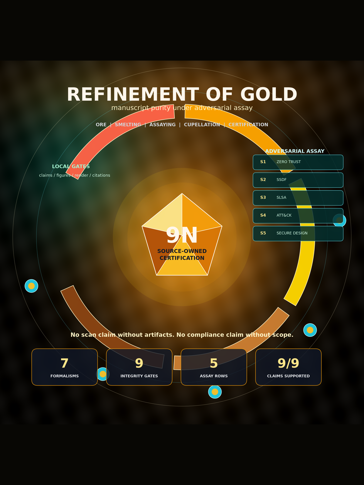

# Gold Refinement — Metallurgical Manuscript Composition Exemplar

> **Domain-skin variant of [`template_madlib`](../template_madlib/README.md).**
> This exemplar reuses the same deterministic token-injection composition core
> as `template_madlib` (`src/composition.py`, `src/config.py`,
> `src/manuscript_variables.py`, and a near-identical `manuscript/config.yaml`
> schema) and shows how to specialize that mega-madlib engine to a concrete
> domain. The metallurgy skin (`src/assay.py`, `src/purity.py`,
> `src/refinery.py`, `src/domain_adapter.py`) maps the abstract composition
> pipeline onto a real refinement sequence:
> ore → smelting → assaying → cupellation → certification. Read
> [`template_madlib`](../template_madlib/README.md) first for the generic engine;
> read this template to see a worked domain specialization of it.



## When to use this template

Use this template for **analogical manuscript composition research**: projects
that map a scientific domain onto a refinement pipeline and generate the
manuscript through deterministic mega-madlib token injection. The gold-refining
analogy (ore → smelting → assaying → karat grading) models manuscript purity
from rough draft through nine-nines certification, with each stage operationalized
by template infrastructure. If your project is primarily numerical optimization,
prose review, or layout, see `template_code_project`, `template_prose_project`,
or `template_newspaper` instead.

## Publication and rendering

The publishing metadata and per-platform status below are **compiled from
`manuscript/config.yaml`** by `infrastructure.publishing.status_report` — do not
hand-edit between the markers; update the config and regenerate (see the legend).

<!-- PUBLISHING-STATUS:START (generated by infrastructure.publishing.status_report) -->
**Refinement of Gold: A Metallurgical Analogy for Scientific Manuscript Composition** · v0.1.0 · MIT · Daniel Ari Friedman

Concept DOI: [10.5281/zenodo.20931955](https://doi.org/10.5281/zenodo.20931955) | Version DOI: [10.5281/zenodo.20938523](https://zenodo.org/records/20938523) | Repository: [docxology/template_gold_refinement](https://github.com/docxology/template_gold_refinement)

Publishing surface — 20 platforms, 7 published:

| Platform | Tier | Status | Reference | Credentials |
| --- | --- | --- | --- | --- |
| zenodo | first-class | ✅ published | [10.5281/zenodo.20931955](https://doi.org/10.5281/zenodo.20931955) | `ZENODO_API_TOKEN` |
| github | first-class | ✅ published | [docxology/template_gold_refinement](https://github.com/docxology/template_gold_refinement) | `GITHUB_TOKEN` |
| arxiv | first-class | ⚪ available | — | — |
| pypi | first-class | ✅ published | [https://test.pypi.org/project/template-gold-refinement/0.1.0/](https://test.pypi.org/project/template-gold-refinement/0.1.0/) | `PYPI_TOKEN`, `TESTPYPI_TOKEN` |
| ipfs_pinata | first-class | ✅ published | [https://gateway.pinata.cloud/ipfs/QmQBXK5qoGv5NSWC8mzcx22AgkHeqBJL8z8HrCgEy7nzio](https://gateway.pinata.cloud/ipfs/QmQBXK5qoGv5NSWC8mzcx22AgkHeqBJL8z8HrCgEy7nzio) | `PINATA_JWT` |
| ipfs_web3storage | first-class | ⚪ available | — | `WEB3_STORAGE_TOKEN` |
| software_heritage | first-class | ✅ published | [https://archive.softwareheritage.org/browse/origin/?origin_url=https://github.com/docxology/template_gold_refinement](https://archive.softwareheritage.org/browse/origin/?origin_url=https://github.com/docxology/template_gold_refinement) | — |
| github_pages | first-class | ⚪ available | [docxology/template_gold_refinement](https://github.com/docxology/template_gold_refinement) | `GITHUB_TOKEN` |
| cloudflare_pages | first-class | ⚪ available | — | `CLOUDFLARE_API_TOKEN` |
| netlify | first-class | ⚪ available | — | `NETLIFY_AUTH_TOKEN` |
| huggingface_hub | first-class | ✅ published | [https://huggingface.co/datasets/ActiveInference/template_gold_refinement](https://huggingface.co/datasets/ActiveInference/template_gold_refinement) | `HUGGINGFACE_TOKEN`, `HF_TOKEN` |
| osf | first-class | ✅ published | [https://osf.io/u485p/](https://osf.io/u485p/) | `OSF_TOKEN` |
| amazon_kdp | documented | 🟡 planned | — | `AMAZON_KDP_EMAIL`, `AMAZON_KDP_PASSWORD` |
| google_play_books | documented | 🟡 planned | — | `GOOGLE_PLAY_BOOKS_SERVICE_ACCOUNT_JSON` |
| gumroad | documented | 🟡 planned | — | `GUMROAD_ACCESS_TOKEN` |
| leanpub | documented | 🟡 planned | — | `LEANPUB_API_KEY` |
| lulu | documented | 🟡 planned | — | `LULU_CLIENT_KEY`, `LULU_CLIENT_SECRET` |
| draft2digital | documented | 🟡 planned | — | `DRAFT2DIGITAL_API_TOKEN` |
| stripe | documented | 🟡 planned | — | `STRIPE_SECRET_KEY`, `STRIPE_PUBLISHABLE_KEY` |
| ingramspark | documented | 🟡 planned | — | `INGRAMSPARK_CLIENT_ID`, `INGRAMSPARK_CLIENT_SECRET` |

_Keywords: gold refining, manuscript composition, mega-madlib, token injection, scientific purity, assaying, karat grading, security assay, supply-chain provenance._

_Status legend: ✅ published (durable identifier recorded in `config.yaml`) · 🔵 reserved (identifier reserved but not yet registered by final publication) · ⚪ available (adapter implemented and locally verifiable) · 🟡 planned. This block is generated — edit `manuscript/config.yaml`, then regenerate with `uv run python -m infrastructure.publishing.status_report --project <path> --write`._
<!-- PUBLISHING-STATUS:END -->

- Canonical renderer: [docxology/template](https://github.com/docxology/template) with `--project templates/template_gold_refinement`
- Tracked outputs: [`output/`](output/) in this project and `output/templates/template_gold_refinement/` in the monorepo; public output files above 50 MB stay out of git.

To regenerate this exemplar from the public monorepo:

```bash
git clone https://github.com/docxology/template
cd template
uv sync
export SOURCE_DATE_EPOCH=1782345600  # 2026-06-25T00:00:00Z, matching manuscript/config.yaml
./run.sh --project templates/template_gold_refinement --pipeline --core-only
uv run python scripts/pipeline/stage_04_validate.py --project templates/template_gold_refinement
uv run python scripts/pipeline/stage_05_copy.py --project templates/template_gold_refinement
```

Keep `SOURCE_DATE_EPOCH` set when refreshing tracked public outputs so dashboard
and manuscript timestamps are reproducible instead of wall-clock dependent.

Standalone repositories are publication mirrors for source, DOI metadata, and
tracked rendered artifacts. Use the monorepo above when you need the full shared
infrastructure, pipeline stages, or cross-template validation.

## Quick Start

```bash
# Run the refinement analysis pipeline
uv run python projects/templates/template_gold_refinement/scripts/refinement_analysis.py

# Run tests
uv run pytest projects/templates/template_gold_refinement/tests/ -v

# Test gate (authoritative)
uv run pytest projects/templates/template_gold_refinement/tests/ \
  --cov=projects/templates/template_gold_refinement/src --cov-fail-under=90
```

## Generated artifact contract

All rendered artifacts are source-owned and disposable. Do not hand-edit
`output/`; regenerate it through Stage 02/03/04 or the project scripts.

| Artifact | Source owner | Purpose |
| --- | --- | --- |
| `output/data/refinery_results.json` | `src/refinery.py`, `src/purity.py` | Canonical purity sequence and certification result |
| `output/reports/token_plan.json` | `src/composition.py`, `manuscript/config.yaml` | Deterministic mega-madlib token choices and provenance |
| `output/reports/claim_support_registry.json` | `src/evidence.py` | Project-local contribution-claim assay |
| `output/reports/evidence_registry.json` | template evidence validator | Shared evidence facts consumed by validation gates |
| `output/figures/figure_registry.json` | `src/figures/_common.py::FIGURE_SPECS` | Figure label/path/caption/source registry |
| `output/reports/figure_quality_report.json` | `src/figures/registry.py::write_figure_quality_report` | PNG/SVG existence, dimensions, nonblank pixels, color variance, and registry parity |
| `output/figures/cover_visualization.png` | `src/cover_visualization.py::generate_cover_visualization` | Standalone publication cover visual; not part of the stable 12-figure manuscript registry |
| `output/reports/cover_visualization.json` | `src/cover_visualization.py::write_cover_visualization` | Cover dimensions, byte sizes, nonwhite fraction, and color variance |

## Visualization and scientific-integrity surface

The visualization layer is a technical contract, not a decorative export.
The `src/figures/` package defines a single `FIGURE_SPECS` registry for all 12 stable
figure labels and writes both PNG and SVG files for every figure. Manuscript
Markdown variables continue to reference PNGs for PDF compatibility; SVG files
are companion artifacts for inspection and reuse.

Graph-like figures use deterministic NetworkX-backed source graphs:

| Figure | Technical encoding |
| --- | --- |
| `fig:provenance_sankey` | Directed stage flow with edge width proportional to purity gain |
| `fig:formalism_traceability` | Formalism → equation label → source-owner graph |
| `fig:implementation_circuit` | Config/code/artifact/manuscript/validator/publication circuit |
| `fig:claim_evidence_assay` | Claim-support bars plus claim → evidence → boundary topology |

Quantitative figures expose late-stage or integrity-relevant structure:
`fig:purity_progression` includes a nines transform, `fig:integrity_risk_matrix`
colors points by source tier and sizes them by residual risk, and
`fig:evidence_tier_ladder` reports source-tier counts and percentages. The
quality report must pass before the visuals should be treated as publication
artifacts.

## The analogy

Gold refining provides a load-bearing pipeline — not merely a rhetorical frame —
for manuscript composition:

| Metallurgical stage | Manuscript operation | Purity target |
| --- | --- | --- |
| Ore (raw material) | Draft prose, raw claims | ~37.5% (9K) |
| Smelting (separation) | Remove dross: filler, unsupported claims | ~75% (18K) |
| Assaying (testing) | Validate claims against evidence | ~91.7% (22K) |
| Refining (cupellation) | Cross-reference resolution, citation audit | ~99.0% (24K) |
| Certification (karat grading) | Full pipeline validation, reproducibility | ~99.9%–99.9999999% (nine-nines) |

Each stage increases purity monotonically. The mega-madlib token engine selects
domain vocabulary deterministically (seeded SHA-256 digest over category
inventories), and every manuscript `{{TOKEN}}` is generated by a single Python
function cross-checked by a live regression test.

## Dependencies

Run `uv sync` at the **repository root** for the shared template pipeline. Stage
02 executes this project with `uv run --directory
projects/templates/template_gold_refinement`, so the project-local
`pyproject.toml` also declares the runtime dependencies needed by the exemplar,
including `networkx>=3.4.2` for deterministic graph layouts.

## Key Features

- **Refinery pipeline**: ore → smelting → assaying → karat grading with monotone purity increase
- **Mega-madlib token injection**: deterministic, seeded, config-owned lexicon
- **Karat grading**: maps purity fractions to standard gold karat grades (9K–24K)
- **Nine-nines certification**: extends purity to 99.9999999% for the final stage
- **Manuscript variable generation**: every prose number is a `{{TOKEN}}` from one Python function
- **Source-owned formalisms**: auto-numbered equation blocks from `src/formalisms.py`
- **Scientific-integrity gates**: claim support, evidence tiers, source owners, and risk dimensions from source registries
- **Technical visualization QA**: PNG+SVG generation, registry parity, nonblank pixel checks, and color-variance checks
- **Zero-mock test suite**: real data, real computation, real files

## More Information

See [AGENTS.md](AGENTS.md) for technical documentation.

## Template integrity

- Forward backlog: [`TODO.md`](TODO.md).
- Copy-and-customize configuration: [`manuscript/config.yaml.example`](manuscript/config.yaml.example).
- Standalone fork guide: [`STANDALONE.md`](STANDALONE.md).
- Project validation: `uv run pytest projects/templates/template_gold_refinement/tests/ --cov=projects/templates/template_gold_refinement/src --cov-fail-under=90`.
- Repo drift validation: `uv run python scripts/audit/check_template_drift.py --strict`.

<!-- foam-orphan-nav:start (auto-managed: links sub-docs so they are reachable) -->

## Directory & sub-document map

Navigation links to in-tree documents (keeps them discoverable):

- [AGENTS.md — template_gold_refinement/data](data/AGENTS.md)
- [data/](data/README.md)
- [Agent Instructions](docs/agent_instructions.md)
- [Architecture](docs/architecture.md)
- [Output Conventions](docs/output_conventions.md)
- [Style Guide](docs/style_guide.md)
- [Syntax Guide](docs/syntax_guide.md)
- [Testing Philosophy](docs/testing_philosophy.md)
- [Troubleshooting](docs/troubleshooting.md)

<!-- foam-orphan-nav:end -->
