# Abstract {#sec:abstract}

This paper presents a metallurgical analogy for scientific manuscript composition, mapping gold-refining stages onto the template infrastructure pipeline. The refinery processes manuscript ore through 5 stages - from raw draft (9K, ~37.5% purity) through smelting, assaying, and cupellation - to an internal nine-nines certification target (99.9999999%). The source domain is grounded in pre-1800 accounts of metals, assaying, parting, fineness, and marking [@pliny_natural_history_33; @biringuccio_pirotechnia_1540; @agricola_de_re_metallica_1556; @badcock_touchstone_1678; @cramer_assaying_metals_1741], while the target domain is a reproducible computational manuscript rather than a claim about universal writing quality.

The analogy is **load-bearing**, not merely rhetorical: each metallurgical stage corresponds to a real template-infrastructure operation. This makes the paper an explicit structure-mapping exercise rather than a loose metaphor [@gentner1983structure; @hesse1966models]. Smelting removes dross (filler, unsupported claims); assaying tests claims against evidence; cupellation resolves cross-references; certification validates the full pipeline. The mega-madlib token engine selects 24 domain tokens deterministically via seeded SHA-256 digest over category inventories, ensuring every prose element is traceable and reproducible.

The contribution is also formalized: 7 equation-backed formalisms define purity, monotone refinement, token selection, claim support, gate vectors, and certification. This positions the manuscript as a research-compendium artifact in the lineage of literate programming, dynamic reports, and reproducible computational research [@knuth1984literate; @leisch2002sweave; @peng2011reproducible; @sandve2013ten]. The project-local claim assay reports 9/9 supported contribution claims (100.00%, passing), while the integrity model exposes 9 source-owned risk dimensions and the shared template evidence registry contributes 0 source-tiered facts when the validation gate has run.

**Results:** The refinery achieves final purity of 99.9999999% (nine-nines) (24K (nine-nines certified)) with a total purity gain of 90.00% across all stages. Nine-nines certification: Yes. The purity progression is shown in [@fig:purity_progression], and the karat grading scale in [@fig:karat_grading].

**Keywords:** gold refining, manuscript composition, mega-madlib, token injection, scientific purity, assaying, karat grading, security assay, supply-chain provenance


```{=latex}
\newpage
```


# Introduction: Ore to Nine-Nines {#sec:introduction}

Gold refining is one of humanity's oldest purification technologies. The pre-1800 record is not a single modern pipeline, but it gives the analogy a real source domain: Pliny's Book XXXIII treats metals, gold extraction, and touchstone testing as recognizable ancient practices; Biringuccio's *De la Pirotechnia* and Agricola's *De re metallica* turn mining, smelting, cupellation, assaying, and parting into printed technical sequences; Cramer's assay manual codifies the theory/practice split of metal testing [@pliny_natural_history_33; @biringuccio_pirotechnia_1540; @agricola_de_re_metallica_1556; @cramer_assaying_metals_1741]. Hallmarking regimes make the verification layer socially and legally visible: a seventeenth-century manual for goldsmiths frames "true standard allay," statutes, weights, and counterfeit coin detection as public controls, while the Goldsmiths' Company Assay Office traces the London leopard's-head mark, maker's mark, and date-letter system through pre-1800 milestones [@badcock_touchstone_1678; @goldsmiths_hallmarking_history]. This paper asks: can that historically plural pipeline serve as a **load-bearing** operational model for scientific manuscript composition - not merely a decorative analogy, but a real mapping from metallurgical stages to template-infrastructure operations?

## The problem

A scientific manuscript accumulates impurities through its drafting lifecycle: unsupported claims, unresolved references, redundant prose, and citation gaps. The template repository provides infrastructure to detect and remove these impurities - validation gates, cross-reference checks, evidence registries, and coverage enforcement. This aligns with a broader reproducible-research literature that treats code, data, environment, and provenance as first-class scientific materials [@buckheit_donoho_1995; @peng2011reproducible; @stodden2011default; @sandve2013ten]. What this exemplar adds is a unifying model that names the purification stages and measures local purity progression.

This exemplar treats source tier and evidence spine as first-class manuscript objects. A claim is not considered refined because it sounds plausible; it is refined when its source path, generated variable, figure label, citation key, and validation gate can all be inspected. That is a narrower claim than empirical truth: reproducibility can set a minimum computational standard without replacing independent replication, domain expertise, or peer review [@peng2011reproducible; @ioannidis2005false].

## The analogy as pipeline

We map five gold-refining stages onto manuscript operations:

- 1. ore (9K)
- 2. smelting (18K)
- 3. assaying (22K)
- 4. cupellation (24K)
- 5. certification (24K (nine-nines certified))

Each stage has a metallurgical operation, a manuscript operation, an input purity, and an output purity. Purity increases monotonically — a constraint enforced by `src/purity.py::assert_monotone_increase` and tested in `tests/test_refinery.py`.

## Mega-madlib token engine

The manuscript's domain vocabulary is not hand-authored prose but config-owned lexical data, selected deterministically by a seeded SHA-256 digest. The engine generates 24 tokens across 11 slots and 8 lexicon categories. Every token choice is reproducible, traceable to its config key, and bound to a manuscript section. In this respect the exemplar extends literate programming and dynamic statistical reporting: code, data, and prose are kept synchronized, but the prose-level choices are also made inspectable [@knuth1984literate; @leisch2002sweave; @marwick2018packaging].

The deeper token inventory is deliberately spread across the paper. Introduction tokens name the integrity frame; methods tokens bind evidence validation, figure registry check, and citation validation to source-owned operations; results tokens surface artifact manifest, figure registry, and token provenance; discussion tokens mark the fork obligation and domain validator where the analogy must stop.

## Implementation circuit

The metaphor becomes operational only when every transformation has an implementation owner. In this exemplar, configuration creates the ore, `src/refinery.py` defines the purity stages, `src/composition.py` turns slots into deterministic tokens, `src/formalisms.py` owns the equation registry, the `src/figures/` package turns those sources into registered visuals, and the template validators decide whether the hydrated manuscript can be treated as publication metal. The loop is deliberately closed: failures from the validators point back to source files, not to hand-polished output.

## Open question pinned

Is the analogy load-bearing or rhetorical? We assert it is **both**: it frames the methods paper (rhetorical) and operationalizes each stage against real infrastructure (load-bearing). Analogy theory gives the discipline for that claim: preserve relational structure, declare negative analogies, and do not transfer unsupported source-domain properties into the target domain [@gentner1983structure; @hesse1966models; @holyoak_thagard_1995]. The open question is not whether to use the analogy, but where the mapping breaks - a question the discussion addresses.


```{=latex}
\newpage
```


# Methodology: The Refinery Pipeline {#sec:methodology}

The refinery pipeline consists of 5 canonical stages, each mapping a metallurgical operation to a manuscript-composition operation. The pipeline is implemented in `src/refinery.py` and validated by `src/purity.py`. The methods surface now has four coupled layers: the refinery stages, the mega-madlib token plan, the generated formalism registry, and the scholarship boundary that determines which claims may be generalized beyond this exemplar.

Methodologically, the paper treats composition as part of a research compendium: authored sources, executable scripts, generated reports, figures, and rendered manuscript outputs are separated but linked [@marwick2018packaging]. That design follows the executable-paper and notebook traditions in which narrative is coupled to runnable analysis rather than copied from it [@leisch2002sweave; @rule2019jupyter]. The novelty claimed here is narrower: the token-level narrative choices are deterministic and provenance-bearing, not that a template can validate scientific truth.

Structured reporting guidelines provide the closest scholarly analogue for the gate layer, but they also set its limit. CONSORT, STROBE, PRISMA, ARRIVE, and the EQUATOR Network define field-specific reporting items so a manuscript can be inspected, appraised, and in some cases replicated more easily [@schulz2010consort; @vonelm2007strobe; @page2021prisma; @percie_du_sert2020arrive; @equator_network_reporting_guidelines]. In this exemplar, token coverage, evidence registration, and render validation play a similar internal role: they make omissions visible and bind declarations to artifacts. They do not test whether an external study was designed well, executed correctly, or substantively true.

The metallurgical side of the method is deliberately historical rather than modern-industrial. Pre-1800 sources support the relational structure - extraction, smelting or refining, assay, parting/cupellation, fineness, and public marking - but not a claim that all regions used the same sequence or that early practitioners held modern chemical theories. Pliny is useful for extraction and touchstone context; Biringuccio and Agricola are useful for staged metallurgical operations; Badcock's *Touch-stone* and the Goldsmiths' Company chronology are useful for standards, weights, statutes, and marks; Cramer is useful for eighteenth-century assay discipline [@pliny_natural_history_33; @biringuccio_pirotechnia_1540; @agricola_de_re_metallica_1556; @badcock_touchstone_1678; @goldsmiths_hallmarking_history; @cramer_assaying_metals_1741]. The normalized five-stage pipeline below is therefore an analogy-preserving abstraction, not a historical claim that "ore -> smelting -> assaying -> cupellation -> certification" was a universal pre-1800 production recipe.

## Stage definitions

| # | Stage | Output purity | Karat | Metallurgical operation |
|---|-------|-------------|-------|------------------------|
| 1 | ore | 37.50% | 9K | Extract raw gold-bearing ore from the earth |
| 2 | smelting | 75.00% | 18K | Heat ore to separate gold from slag and dross |
| 3 | assaying | 91.67% | 22K | Test a sample to determine gold content and impurities |
| 4 | cupellation | 99.900% | 24K | Refine by blowing air through molten lead-gold alloy |
| 5 | certification | 99.9999999% (nine-nines) | 24K (nine-nines certified) | Certify purity grade and stamp hallmark |

## Purity progression

The purity sequence across all stages is: 0.100000, 0.375000, 0.750000, 0.916700, 0.999000, 1.000000

Purity is strictly increasing — enforced by `assert_monotone_increase()` which raises `ValueError` if any stage's output purity does not exceed its input. Formally, for stages $s_1, \ldots, s_n$ with input purity $p_{\text{in}}^{(i)}$ and output purity $p_{\text{out}}^{(i)}$:

$$
p_{\text{out}}^{(i)} > p_{\text{in}}^{(i)} \quad \text{and} \quad p_{\text{in}}^{(i+1)} = p_{\text{out}}^{(i)} \quad \forall i \in \{1, \ldots, n-1\}
$$

The full purity progression is shown in [@fig:purity_progression] (see [@sec:results]).

## Formalism registry

The formal layer is generated from `src/formalisms.py`, not hand-numbered prose. [@tbl:formalism_registry] lists the source evidence for each equation, and the equation blocks below are auto-numbered by the renderer.

| ID | Formalism | Equation | Source |
|----|-----------|----------|--------|
| F1 | Purity functional | [@eq:purity_functional] | `src/purity.py::format_purity` |
| F2 | Monotone refinement | [@eq:monotone_refinery] | `src/purity.py::assert_monotone_increase` |
| F3 | Token-selection digest | [@eq:token_digest] | `src/composition.py::_choose_value` |
| F4 | Claim-support fraction | [@eq:claim_support] | `src/evidence.py::EvidenceRegistry.support_rate` |
| F5 | Integrity vector | [@eq:integrity_vector] | `manuscript/config.yaml#gold_refinement.audit_rules` |
| F6 | Certification predicate | [@eq:certification_predicate] | `src/refinery.py::RefineryResult.is_nine_nines_certified` |
| F7 | Adversarial assay | [@eq:adversarial_assay] | `src/security_assay.py::build_security_assay` |
: Source-owned formalism registry. {#tbl:formalism_registry}

**F1: Purity functional.** Manuscript purity is treated as a bounded fraction mapped to a reader-facing grade.

$$
\pi(s) \in [0, 1], \qquad g(s) = \operatorname{karat}(\pi(s))
$$ {#eq:purity_functional}

The value is descriptive: it summarizes local validation state rather than external quality. Source: `src/purity.py::format_purity`.

**F2: Monotone refinement.** A valid refinery run requires every stage to improve the previous purity state.

$$
\pi_0 < \pi_1 < \cdots < \pi_n
$$ {#eq:monotone_refinery}

The test suite rejects equal or decreasing stage outputs. Source: `src/purity.py::assert_monotone_increase`.

**F3: Token-selection digest.** Every mega-madlib token is selected from config-owned inventory by a deterministic digest.

$$
i = \operatorname{int}(\operatorname{SHA256}(seed \Vert slot \Vert category \Vert ordinal \Vert inventory)_{0:12}, 16) \bmod \lvert inventory \rvert
$$ {#eq:token_digest}

Changing the seed or inventory changes the plan; replaying both reproduces it. Source: `src/composition.py::_choose_value`.

**F4: Claim-support fraction.** Contribution claims are assayed by counting supported local evidence pointers.

$$
\sigma = \frac{\lvert\{c \in C : supported(c)\}\rvert}{\lvert C \rvert}
$$ {#eq:claim_support}

The numerator and denominator come from the project-local claim-support registry. Source: `src/evidence.py::EvidenceRegistry.support_rate`.

**F5: Integrity vector.** Scientific integrity is represented as a vector of gate outcomes rather than one scalar badge.

$$
\mathbf{v} = (v_{tokens}, v_{figures}, v_{claims}, v_{render}, v_{references}, v_{security})
$$ {#eq:integrity_vector}

A publication claim is only as strong as the weakest required gate. Source: `manuscript/config.yaml#gold_refinement.audit_rules`.

**F6: Certification predicate.** Certification is a predicate over final purity and validation readiness.

$$
\operatorname{certified}(r) \iff \pi_{final}(r) \geq 0.999999999 \land gates(r)
$$ {#eq:certification_predicate}

The predicate binds the nine-nines metaphor to the actual validation chain. Source: `src/refinery.py::RefineryResult.is_nine_nines_certified`.

**F7: Adversarial assay.** Certification requires an explicit adversarial and supply-chain scope, not only ordinary gate success.

$$
\operatorname{certified}_{adv}(r) \iff \operatorname{certified}(r) \land \forall a \in A_r:\ threat(a) \land standard(a) \land evidence(a) \land validator(a) \land boundary(a)
$$ {#eq:adversarial_assay}

The adversarial assay defines scope and evidence requirements; it is not proof of compliance or live scan findings. Source: `src/security_assay.py::build_security_assay`.

## Token selection

The mega-madlib engine selects tokens from config-owned lexicon categories using a deterministic digest:

$$
\text{index} = \text{int}\left(\text{SHA-256}\left(\text{seed} \mid \text{slot} \mid \text{category} \mid \text{ordinal} \mid \text{inventory}\right)[:12], 16\right) \mod n
$$

where $n$ is the size of the lexicon category inventory. Selected metallurgical terms: assaying, parting, smelting. Selected manuscript terms: evidence, evidence. The same digest rule is formalized in [@eq:token_digest], while the gate vocabulary for this section binds evidence validation, figure registry check, and citation validation to concrete validation surfaces.

## Config-owned lexicon

| Category | Count | Sample |
|----------|-------|--------|
| boundary_terms | 5 | local claim, analogy boundary, fork obligation... |
| evidence_terms | 5 | fact registry, artifact manifest, citation check... |
| gate_terms | 5 | prerender, evidence validation, figure registry check... |
| integrity_terms | 5 | evidence spine, source tier, validation gate... |
| manuscript_terms | 5 | draft, claim, citation... |
| metallurgical_terms | 5 | cupellation, assaying, smelting... |
| purity_adjectives | 5 | unrefined, purified, certified... |
| refinement_verbs | 5 | assaying, certifying, refining... |

## Karat grading

Karat grades map purity fractions to a gold-fineness vocabulary used here as an analogy surface. The pre-1800 evidence supports fineness as a regulated testing and marking problem, but not the modern nine-nines target used by this local software predicate [@badcock_touchstone_1678; @goldsmiths_hallmarking_history; @cramer_assaying_metals_1741; @marsden_house_2006; @lbma_good_delivery_rules]:

- 9K = 37.5% (ore stage)
- 18K = 75.0% (smelting stage)
- 22K = 91.67% (assaying stage)
- 24K = 99.9% (cupellation stage)
- Nine-nines = 99.9999999% (certification stage)

The mapping is implemented in `src/purity.py::karat_for_purity()`. The final nine-nines target is a deliberately stringent local certification predicate, not an assertion that all gold markets or manuscript-quality regimes use that threshold. The karat grading chart is shown in [@fig:karat_grading] (see [@sec:results]).

## Pipeline phases

| Phase | Input | Transformation | Output | Guard |
|-------|-------|----------------|--------|-------|
| Schema intake | manuscript/config.yaml | Load and validate gold_refinement block | GoldRefinementConfig | config schema tests |
| Refinery execution | GoldRefinementConfig | Run five refinery stages with monotone purity | RefineryResult | monotone purity test |
| Token planning | GoldRefinementConfig | Expand slots into deterministic token choices | TokenPlan | seed-stability tests |
| Figure generation | RefineryResult and TokenPlan | Generate purity progression, karat grading, and token density figures | ../figures/*.png | nonblank figure tests |
| Integrity risk modeling | audit rules, failure modes, claims, and shared evidence registry | Score integrity dimensions and summarize evidence tiers | integrity tables and risk visualizations | tests/test_integrity.py |
| Security assay | gold_refinement.security_assay | Map adversarial threats and standards to source-owned evidence and claim boundaries | security assay table and variables | tests/test_security_assay.py |
| Manuscript hydration | manuscript shells and manuscript_variables.json | Resolve {{TOKEN}} placeholders into output/manuscript/ | hydrated Markdown manuscript | unresolved-token scan |
| Render and validate | output/manuscript | Render PDF, HTML through shared template pipeline | output/pdf and output/web | render command |

The pipeline table is intentionally operational rather than decorative: a fork that changes the stages must update the source function, generated variables, figures, and validation gates together.

## Implementation trace

The implementation circuit shown in [@fig:implementation_circuit] is the method's wiring diagram. It distinguishes three ownership layers. First, authored sources own intent: config declares vocabulary and claims, `src/` owns computation, and the claim ledger registers evidence facts. Second, generated artifacts own observation: token plans, figures, resolved Markdown, reports, and dashboards are rebuilt rather than edited. Third, template gates own permission to promote the manuscript: unresolved tokens, unsupported facts, missing citations, broken references, and invalid PDFs block certification. This is the manuscript analogue of provenance-aware workflow design: entities, activities, agents, and generated outputs are kept traceable so readers can assess reliability rather than infer it from polished prose [@moreau2013prov; @belhajjame2015ontologies].

This split keeps the gold metaphor honest. A fork is allowed to change the ore, the furnace, or the assay, but it must do so in the source layer and then let the generated and validation layers expose the consequences.

## Adversarial assay layer

The implementation trace handles accidental drift: missing tokens, unsupported claims, malformed citations, stale figures, or broken renders. A security assay adds a different question: could the manuscript sound certified while omitting threat scope, supply-chain provenance, or scan evidence? The assay therefore treats zero trust, secure software development, supply-chain provenance, attack-path modeling, SBOM standards, and secure-by-design guidance as boundary-setting standards rather than proof of compliance [@nist_sp800_207_zero_trust; @nist_sp800_218_ssdf; @slsa_v1_2; @sigstore_docs; @mitre_attack; @cyclonedx_spec; @spdx_spec; @cisa_secure_by_design].

This pass implements that layer as source-owned rows in `gold_refinement.security_assay` and generated variables from `src/security_assay.py`. It does not run Codex Security or Deep Security Scan, and it does not report vulnerability findings. Instead, [@eq:adversarial_assay] requires every adversarial assay row to name a threat, standard or guidance source, local evidence surface, validator, and claim boundary before certification language is allowed to expand beyond ordinary template gates. The generated assay table appears in [@tbl:security_assay].

## Scientific integrity model

The integrity model converts manuscript risks into source-owned dimensions. It does not replace peer review or domain validation. It names the failure class, severity, detectability, evidence surface, owner, and validator so the manuscript can distinguish "the analogy is vivid" from "the claim is backed by a regenerable check." The current pass reports 9 integrity dimensions; highest residual risk is I4 (Analogy boundary) at 15.

| ID | Dimension | Residual risk | Owner | Validator |
|----|-----------|---------------|-------|-----------|
| I1 | Monotone refinery | 4 | source code | tests/test_refinery.py |
| I2 | Lexicon completeness | 3 | config | tests/test_config.py |
| I3 | Token hydration | 5 | generated variables | tests/test_manuscript_variables.py |
| I4 | Analogy boundary | 15 | claim ledger | infrastructure.validation.cli evidence --fail-on-issues |
| I5 | Claim support | 10 | evidence assay | output/reports/claim_support_registry.json |
| I6 | Figure registry | 8 | figure producer | tests/test_registry_integrity.py |
| I7 | Citation hygiene | 4 | bibliography | infrastructure.reference.citation validate |
| I8 | Render readiness | 8 | template pipeline | template pipeline render and validate stages |
| I9 | Adversarial security assay | 15 | security assay | tests/test_security_assay.py and manuscript source review |
: Source-owned scientific-integrity dimensions. {#tbl:integrity_dimensions}

The residual-risk score is deliberately simple: high severity and low detectability raise priority. The score is not a universal risk model; it is a local audit heuristic used to decide where a fork must add validators before expanding claims.

| Owner | Dimensions |
|-------|------------|
| bibliography | 1 |
| claim ledger | 1 |
| config | 1 |
| evidence assay | 1 |
| figure producer | 1 |
| generated variables | 1 |
| security assay | 1 |
| source code | 1 |
| template pipeline | 1 |
: Integrity dimensions by owning surface. {#tbl:integrity_owners}

This table also makes generated-number ownership explicit. Counts, support rates, and figure labels belong to regenerated reports and registries; the manuscript consumes them through variables. Authored prose may interpret those values, but it should not silently restate them as hand-maintained facts.


```{=latex}
\newpage
```


# Results: Purity Progression and Karat Grading {#sec:results}

The refinery pipeline produces a monotonically increasing purity sequence across 5 stages, reaching final purity of 99.9999999% (nine-nines) (24K (nine-nines certified)).

## Purity progression

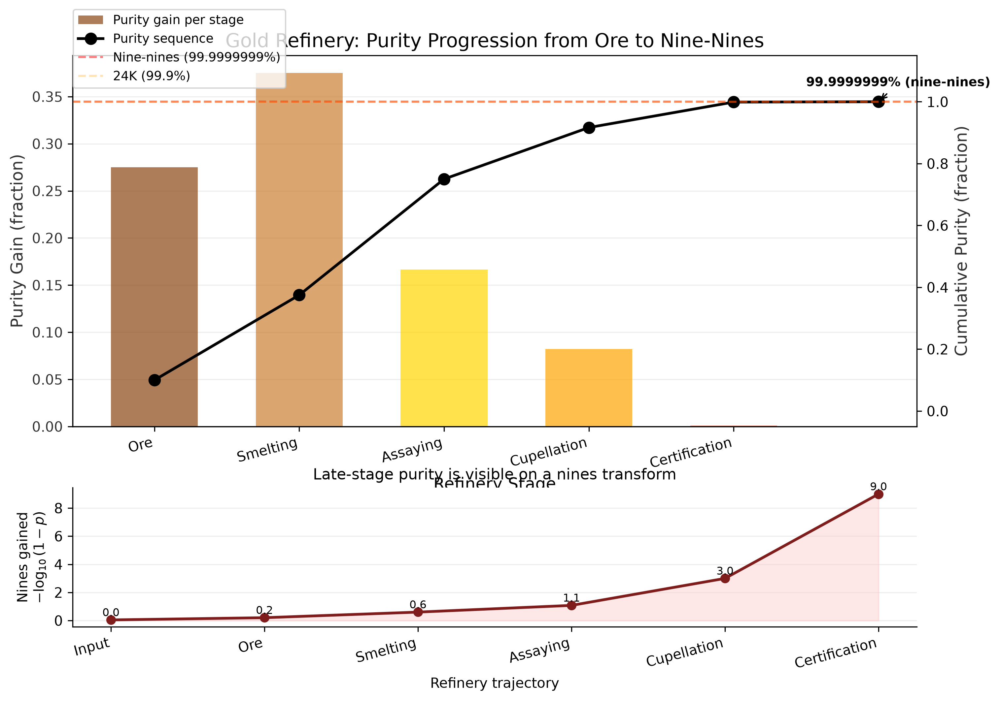{#fig:purity_progression}

| Stage | Name | Output purity | Karat | Gain |
|-------|------|--------------|-------|------|
| 1 | ore | 37.50% | 9K | Extract raw gold-bearing ore from the earth |
| 2 | smelting | 75.00% | 18K | Heat ore to separate gold from slag and dross |
| 3 | assaying | 91.67% | 22K | Test a sample to determine gold content and impurities |
| 4 | cupellation | 99.900% | 24K | Refine by blowing air through molten lead-gold alloy |
| 5 | certification | 99.9999999% (nine-nines) | 24K (nine-nines certified) | Certify purity grade and stamp hallmark |

## Karat grading scale

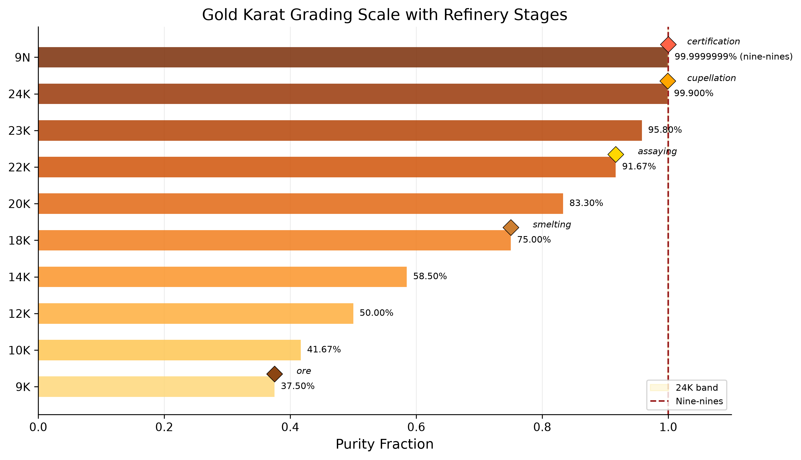{#fig:karat_grading}

## Final certification

- **Final purity:** 99.9999999% (nine-nines)
- **Final karat:** 24K (nine-nines certified)
- **Total purity gain:** 90.00%
- **Nine-nines certified:** Yes
- **Nines count:** 9

## Token plan summary

The mega-madlib engine generated 24 tokens from seed 431 across 8 lexicon categories.

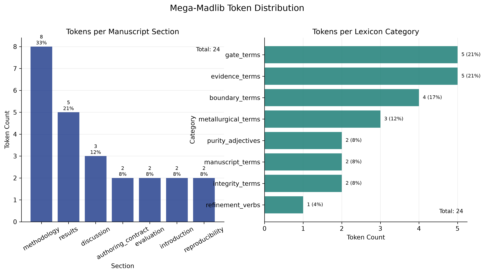{#fig:token_density}

### Category distribution

| Category | Count |
|----------|-------|
| boundary_terms | 4 |
| evidence_terms | 5 |
| gate_terms | 5 |
| integrity_terms | 2 |
| manuscript_terms | 2 |
| metallurgical_terms | 3 |
| purity_adjectives | 2 |
| refinement_verbs | 1 |

### Section distribution

| Section | Token count |
|---------|-----------|
| authoring_contract | 2 |
| discussion | 3 |
| evaluation | 2 |
| introduction | 2 |
| methodology | 8 |
| reproducibility | 2 |
| results | 5 |

### Provenance trace

| Variable | Category | Value | Section | Source |
|----------|----------|-------|---------|--------|
| AUTHORING_BOUNDARY_TERM_1 | boundary_terms | analogy boundary | authoring_contract | manuscript/config.yaml#gold_refinement.lexicon.boundary_terms[1] |
| AUTHORING_BOUNDARY_TERM_2 | boundary_terms | non-claim | authoring_contract | manuscript/config.yaml#gold_refinement.lexicon.boundary_terms[4] |
| DISCUSSION_BOUNDARY_TERM_1 | boundary_terms | fork obligation | discussion | manuscript/config.yaml#gold_refinement.lexicon.boundary_terms[2] |
| DISCUSSION_BOUNDARY_TERM_2 | boundary_terms | domain validator | discussion | manuscript/config.yaml#gold_refinement.lexicon.boundary_terms[3] |
| DISCUSSION_REFINEMENT_VERB | refinement_verbs | smelting | discussion | manuscript/config.yaml#gold_refinement.lexicon.refinement_verbs[3] |
| EVALUATION_GATE_TERM_1 | gate_terms | prerender | evaluation | manuscript/config.yaml#gold_refinement.lexicon.gate_terms[0] |
| EVALUATION_GATE_TERM_2 | gate_terms | citation validation | evaluation | manuscript/config.yaml#gold_refinement.lexicon.gate_terms[3] |
| INTRO_INTEGRITY_TERM_1 | integrity_terms | source tier | introduction | manuscript/config.yaml#gold_refinement.lexicon.integrity_terms[1] |
| INTRO_INTEGRITY_TERM_2 | integrity_terms | evidence spine | introduction | manuscript/config.yaml#gold_refinement.lexicon.integrity_terms[0] |
| METHOD_GATE_TERM_1 | gate_terms | evidence validation | methodology | manuscript/config.yaml#gold_refinement.lexicon.gate_terms[1] |
| METHOD_GATE_TERM_2 | gate_terms | figure registry check | methodology | manuscript/config.yaml#gold_refinement.lexicon.gate_terms[2] |
| METHOD_GATE_TERM_3 | gate_terms | citation validation | methodology | manuscript/config.yaml#gold_refinement.lexicon.gate_terms[3] |
| METHOD_MANUSCRIPT_TERM_1 | manuscript_terms | evidence | methodology | manuscript/config.yaml#gold_refinement.lexicon.manuscript_terms[4] |
| METHOD_MANUSCRIPT_TERM_2 | manuscript_terms | evidence | methodology | manuscript/config.yaml#gold_refinement.lexicon.manuscript_terms[4] |
| METHOD_METAL_TERM_1 | metallurgical_terms | assaying | methodology | manuscript/config.yaml#gold_refinement.lexicon.metallurgical_terms[1] |
| METHOD_METAL_TERM_2 | metallurgical_terms | parting | methodology | manuscript/config.yaml#gold_refinement.lexicon.metallurgical_terms[3] |
| METHOD_METAL_TERM_3 | metallurgical_terms | smelting | methodology | manuscript/config.yaml#gold_refinement.lexicon.metallurgical_terms[2] |
| REPRO_EVIDENCE_TERM_1 | evidence_terms | fact registry | reproducibility | manuscript/config.yaml#gold_refinement.lexicon.evidence_terms[0] |
| REPRO_EVIDENCE_TERM_2 | evidence_terms | figure registry | reproducibility | manuscript/config.yaml#gold_refinement.lexicon.evidence_terms[3] |
| RESULTS_EVIDENCE_TERM_1 | evidence_terms | artifact manifest | results | manuscript/config.yaml#gold_refinement.lexicon.evidence_terms[1] |
| RESULTS_EVIDENCE_TERM_2 | evidence_terms | figure registry | results | manuscript/config.yaml#gold_refinement.lexicon.evidence_terms[3] |
| RESULTS_EVIDENCE_TERM_3 | evidence_terms | token provenance | results | manuscript/config.yaml#gold_refinement.lexicon.evidence_terms[4] |
| RESULTS_PURITY_ADJ_1 | purity_adjectives | unrefined | results | manuscript/config.yaml#gold_refinement.lexicon.purity_adjectives[0] |
| RESULTS_PURITY_ADJ_2 | purity_adjectives | purified | results | manuscript/config.yaml#gold_refinement.lexicon.purity_adjectives[1] |

Selected purity adjectives for this section: unrefined, purified. Selected evidence terms: artifact manifest, figure registry, token provenance.

## Provenance flow

The provenance flow in [@fig:provenance_sankey] makes the refinement analogy
auditable as a directed source path rather than a decorative metaphor. The graph
starts from the same stage sequence used in the purity table and carries that
sequence forward to certification, with edge width proportional to the purity
gain owned by `src/refinery.py::run_refinery`. A reader can therefore ask where
each improvement enters the pipeline and whether it is supported by the same
source that generated the reported purity numbers.

The main result is structural: certification is not allowed to appear as a
terminal label detached from the intermediate stages. It is only reached after
the upstream transformations have been generated, ordered, and connected. This
matters for the manuscript contract because provenance is doing more than
recording file paths. It is preserving causal custody from raw material through
assay and final certification, so a later change to the stage model must move
through the same graph, table, and validation surfaces.

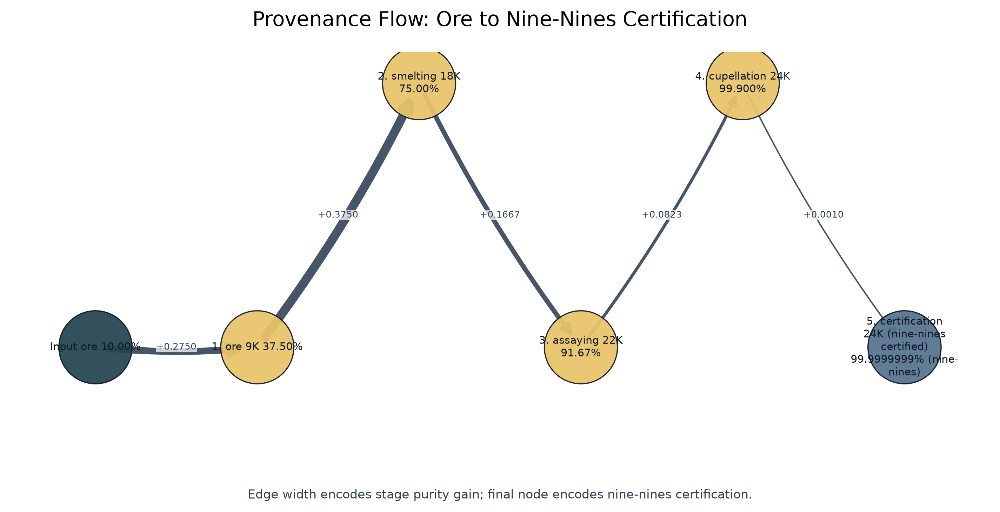{#fig:provenance_sankey}

## Purity vs claim support

The purity-versus-claim-support view in [@fig:purity_claim_scatter] places the
metallurgical purity sequence beside the contribution ledger. This prevents the
paper from treating purity as an isolated aesthetic score. A point can advance
only when two surfaces agree: the refinery computation supplies the stage purity,
and the claim-support registry supplies the cumulative evidence exposure for
the claims being made at that level of refinement.

In the current generated assay, 9 of
9 contribution claims are supported
(100.00%). The figure is useful because it would make a weaker
state visible immediately: a manuscript could still show late-stage material
purity while failing to carry its claims along the evidence axis. In that case,
the visual story would split, and the reader would see that certification prose
had outrun claim support. Here the two axes are deliberately co-present, so the
results section cannot celebrate purity while hiding unsupported contribution
language in a separate paragraph.

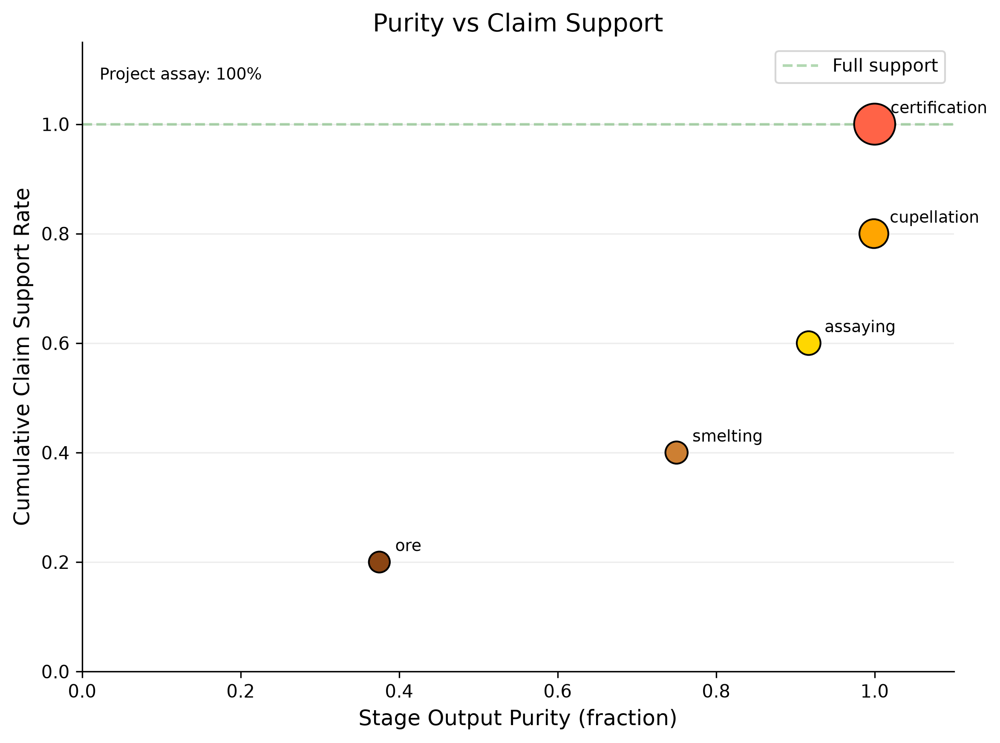{#fig:purity_claim_scatter}

## Token selection sensitivity

The token selection heatmap in [@fig:token_heatmap] turns the mega-madlib engine
into an inspectable sensitivity surface. The manuscript uses seed 431
for the reported token plan, but the figure asks a neighboring question: how do
selected inventory indices move when seeds and lexicon categories vary? This is
not a stochastic robustness claim. It is a deterministic audit of the digest
rule in `src/composition.py::generate_token_plan` against the configured
lexicon inventories in `manuscript/config.yaml`.

This view separates three issues that prose alone tends to blur. First, token
injection is reproducible: the same seed and inventory generate the same
choices. Second, the available vocabulary is a real input surface: a thin or
unbalanced category would be visible as a constrained selection band. Third,
render-time hydration is not silently sampling new language. The heatmap
therefore protects the manuscript from a common generative-writing failure mode,
where a polished section appears stable but its wording is actually controlled
by hidden or late-bound choices. The result is a sensitivity check on authoring
machinery, not a claim that any particular synonym is scientifically superior.

{#fig:token_heatmap}

## Integrity gate matrix

The integrity gate matrix in [@fig:integrity_gate_matrix] makes the validation story visible: audit rules are not prose promises unless they connect to tests, manuscript surfaces, and generated artifacts.

Each row begins as a configured audit rule, but the matrix asks whether that rule
has enough contact with the project to matter. A rule that names a risk but does
not touch tests, manuscript text, or generated outputs remains advisory. A rule
that reaches all three surfaces becomes enforceable: tests can fail, manuscript
hydration can expose stale or missing variables, and generated reports can show
whether the artifact exists. The matrix is therefore a map of operational
coverage, not a checklist of intentions.

This is the validation story that supports the broader purity analogy. Smelting
can remove obvious dross, but scientific-integrity failures often survive as
well-written unsupported claims, stale tables, or figures that no longer match
their source data. By separating missing, partial, and full coverage across gate
surfaces, [@fig:integrity_gate_matrix] identifies where a future author would
need to add a test, generated artifact, or manuscript variable before
strengthening a claim. The result is intentionally local to this exemplar:
coverage is measured against the specific audit rules configured here, not
against a universal publication-readiness standard.

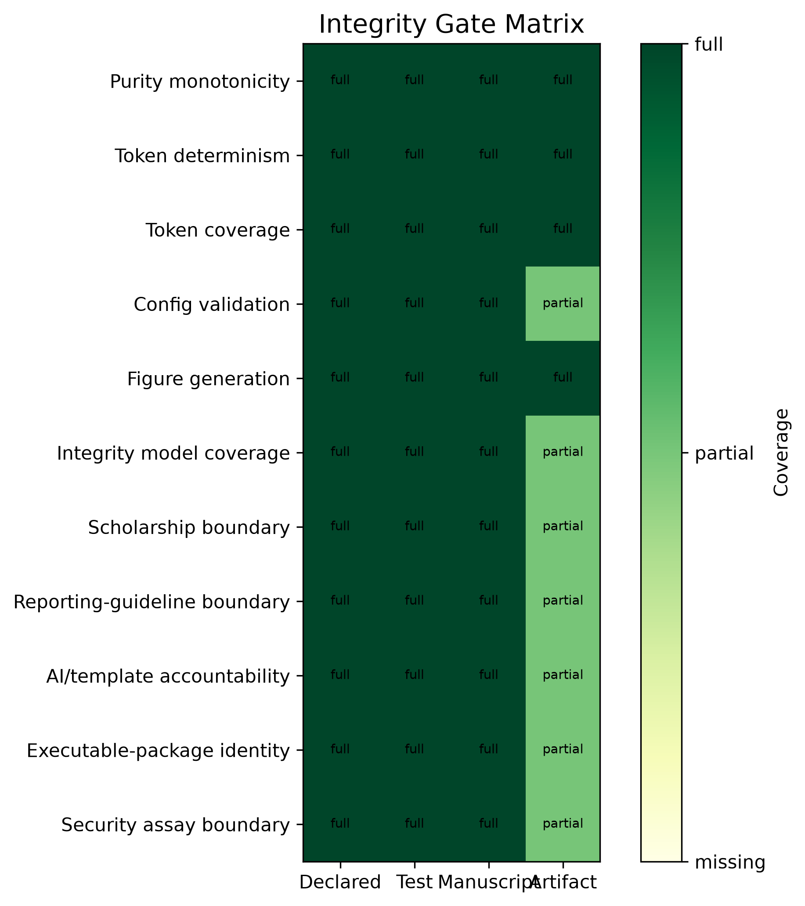{#fig:integrity_gate_matrix}

## Formalism traceability

The formalism traceability view in [@fig:formalism_traceability] links each equation-backed formalism to the source surface that owns it. This is the visual counterpart to [@tbl:formalism_registry].

The registry currently exposes 7 source-owned formalisms. The
figure makes their ownership legible by linking each formalism to its equation
identifier and to the source surface that emits it. That linkage is important
because equation labels can otherwise create a false sense of rigor: a numbered
equation looks formal even when its assumptions, variables, and implementation
owner are not recoverable. Here the formal object must remain connected to
`src/formalisms.py`, the generated registry table, and the manuscript reference
that consumes it.

The graph also helps distinguish formal support from decorative notation. A
formalism earns a place in the manuscript only when it names a claim boundary or
computation that the source can regenerate. If an equation is added without a
source owner, it should fail this traceability pattern before it becomes part of
the results narrative. Conversely, if the source registry changes, the visual
traceability layer should change with it. That is the desired behavior: the
formal layer is a generated contract, not hand-maintained mathematical
ornamentation.

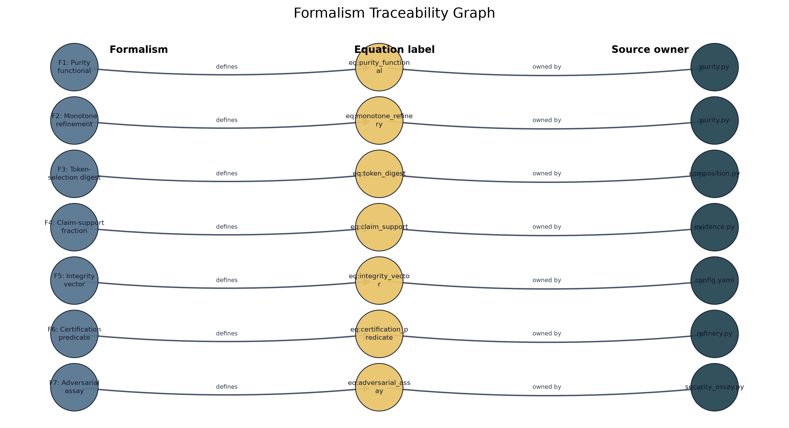{#fig:formalism_traceability}

## Implementation circuit

The implementation circuit in [@fig:implementation_circuit] shows how the concept is executed rather than merely described. Configuration feeds code; code emits variables, figures, and reports; manuscript hydration consumes those artifacts; validators feed errors back to source ownership. The figure is intentionally circular because the artifact is not complete after prose generation. It is complete only after the validation return path has no blocking evidence, citation, reference, or render failures.

The circuit is the results section's strongest guard against a prose-only
interpretation of the template. It shows four layers that must remain connected:
configuration, project code, generated artifacts, and validation feedback. A
change in `manuscript/config.yaml` is not complete when the file is saved. It
must pass through source functions, generate updated variables and figures,
hydrate the manuscript, and survive the validator return path. The circular
layout is therefore a process claim: the manuscript is complete only when the
loop closes without unresolved failures.

This view also explains why the exemplar treats generated output as disposable
but not optional. Output files are not edited by hand, yet they are the evidence
surface through which the reader and validators inspect the source contract.
When a validator reports a broken citation, missing figure, stale variable, or
unsupported claim, the circuit points backward to the owning source surface
rather than encouraging local patching of rendered Markdown. That direction of
repair is central to the manuscript's definition of refinement.

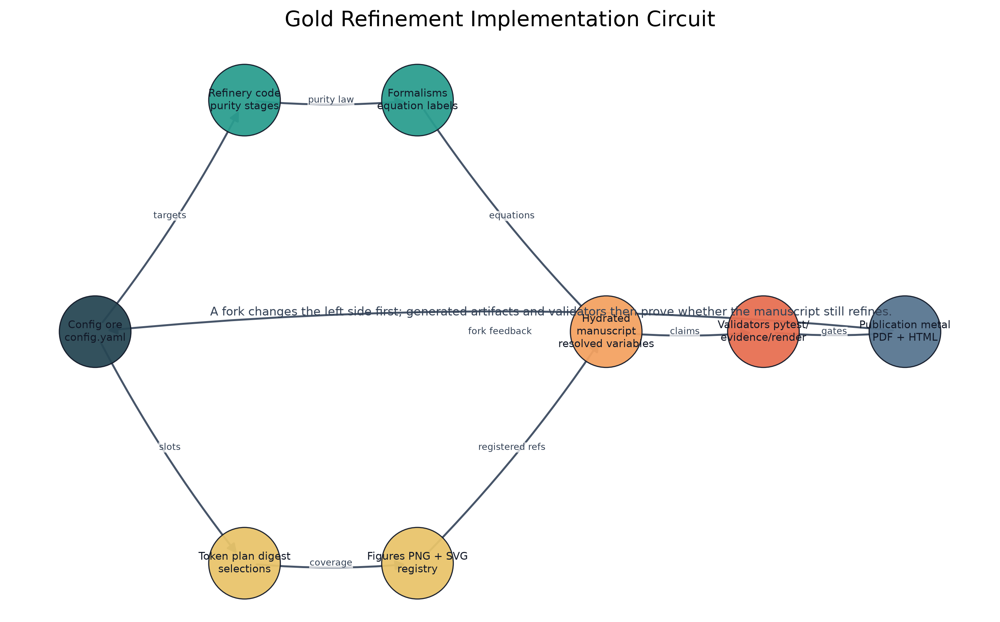{#fig:implementation_circuit}

## Claim-evidence assay

The claim-evidence assay in [@fig:claim_evidence_assay] turns the assaying stage into a reader-facing diagnostic. Each bar is a contribution claim from `manuscript/config.yaml`, and each annotation names the source file or symbol used to support it. This makes the contribution ledger inspectable at the same level as the purity plots: unsupported claims would appear as failed assays rather than remaining hidden in prose.

The generated assay currently reports 9 supported
claims out of 9. The value of the figure is not the perfect
score by itself; it is the way the score is forced to name its evidence surface
and boundary. A contribution claim is not merely present in prose. It must be
registered, matched to supporting evidence, and assigned a boundary that tells
the reader what the support does not cover. This keeps contribution language
from drifting beyond the local evidence available in the project.

The bar-plus-topology design makes two failure modes visible. If a claim lacks
support, the bar view would show the failed assay directly. If a claim is
supported only within a narrow scope, the graph side still preserves the boundary
classification rather than flattening the result into a binary pass. That
matters for the security and integrity extensions in this manuscript: a claim
can be source-owned without becoming a compliance claim, and a generated assay
can confirm local evidence without pretending to certify the wider supply chain.

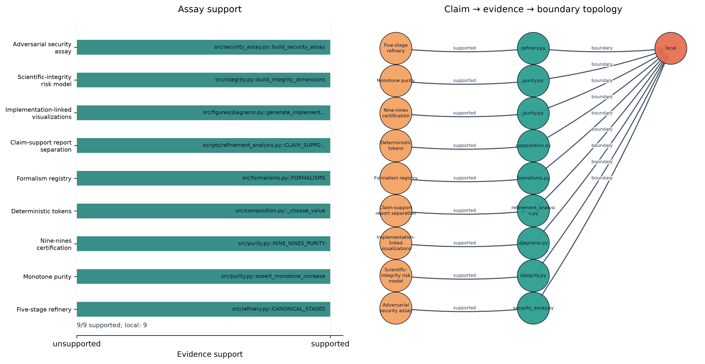{#fig:claim_evidence_assay}

## Scientific-integrity risk matrix

The integrity risk matrix in [@fig:integrity_risk_matrix] plots severity against detectability for the 9 integrity dimensions in [@tbl:integrity_dimensions]. Bubble size encodes residual risk, while color encodes the source tier that owns the evidence surface. This makes boundary failures more visible than cosmetic source checks without hiding whether the support comes from config, source code, claim ledger, generated metric, artifact, bibliography, or validation gate. The matrix is intentionally local: it prioritizes where this exemplar needs source ownership, not where every future manuscript should focus.

The generated summary is: 9 integrity dimensions; highest residual risk is I4 (Analogy boundary) at 15. The matrix turns that
summary into a triage surface. Severity asks how damaging a failure would be if
it entered the manuscript. Detectability asks how readily the current project
would catch it. Residual risk then becomes visible as size rather than being
buried in a paragraph. A large point in a hard-to-detect region is a signal that
the authoring contract needs stronger source ownership or a clearer boundary,
even if the current text renders successfully.

Color is equally important because not all evidence tiers have the same
authority. A bibliography-backed statement, a source-code computation, a claim
ledger row, and a validation-gate result can all support prose, but they support
different kinds of claims. The risk matrix keeps that distinction visible. It
does not collapse integrity into a single score, and it does not imply that
every high-severity issue has already been eliminated. It shows which risks this
exemplar has made inspectable and where future work would need to add stronger
measurement before using stronger language.

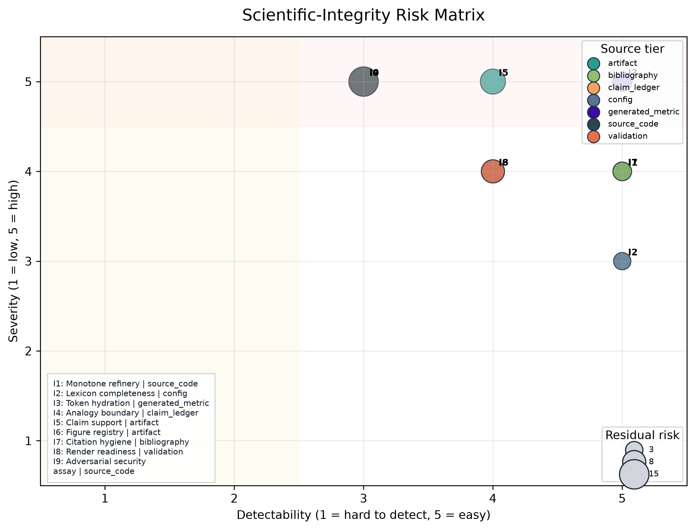{#fig:integrity_risk_matrix}

## Evidence-tier ladder

The evidence-tier ladder in [@fig:evidence_tier_ladder] summarizes the evidence surfaces available to the shared template evidence registry or, before that gate has run, the fallback source tiers from the integrity model. It gives a quick view of whether the manuscript is leaning on generated metrics, claim-ledger facts, bibliography records, source code, or disposable artifacts.

The ladder complements the risk matrix by counting source tiers rather than
plotting risks. When the shared evidence registry is available, the manuscript
can report 0 source-tiered facts to the validation
surface. When that registry is not available, the same figure falls back to the
integrity model's configured tiers. Either way, the reader sees the evidentiary
mix instead of receiving an undifferentiated assurance that evidence exists.

This matters because evidence balance is itself an integrity signal. A manuscript
that leans only on generated artifacts may be reproducible but weakly grounded
in source rationale. A manuscript that leans only on bibliography may be
well-cited but not locally executable. A manuscript that leans only on tests may
catch regressions while still failing to explain claim boundaries to readers.
The ladder gives a compact audit of that mix, while [@tbl:evidence_tiers] keeps
the counts visible in tabular form. Together they close the figure sequence by
showing not only that the 12 public figures render, but
also which source tiers make their claims inspectable.

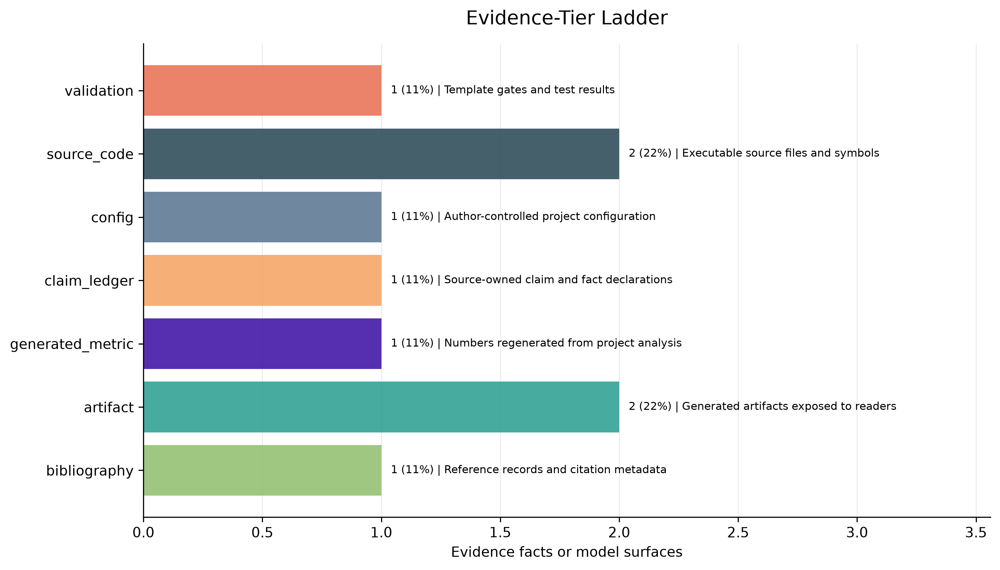{#fig:evidence_tier_ladder}

| Source tier | Count | Role |
|-------------|-------|------|
| artifact | 2 | Generated artifacts exposed to readers |
| source_code | 2 | Executable source files and symbols |
| bibliography | 1 | Reference records and citation metadata |
| claim_ledger | 1 | Source-owned claim and fact declarations |
| config | 1 | Author-controlled project configuration |
| generated_metric | 1 | Numbers regenerated from project analysis |
| validation | 1 | Template gates and test results |
: Evidence tiers used by the integrity model and shared registry when available. {#tbl:evidence_tiers}

## Adversarial security assay

The adversarial assay reports 5 adversarial assay rows mapping threats and standards to local evidence surfaces, validators, and claim boundaries; they are scope controls, not completed scan findings. No Codex Security or Deep Security Scan findings are claimed unless a scan artifact is generated, validated, and cited. The rows are generated from `gold_refinement.security_assay` and are intentionally tabular rather than a new public figure, so the visual registry remains the stable 12-figure contract.

| ID | Threat | Standard or guidance | Evidence surface | Validator or gate | Claim boundary |
|----|--------|----------------------|------------------|-------------------|----------------|
| S1 | implicit trust in generated artifacts | NIST SP 800-207 zero trust | output/reports/evidence_registry.json and src/security_assay.py | infrastructure.validation.cli evidence --fail-on-issues | documents a verification posture, not a deployed zero-trust architecture |
| S2 | incomplete secure-development evidence | NIST SP 800-218 secure software development framework | tests/, pre-render validation, and claim ledger | project test suite and template validation gates | maps local practices to SSDF concepts without claiming SSDF compliance |
| S3 | supply-chain or build provenance compromise | SLSA v1.2, Sigstore, SPDX, and CycloneDX | config hash, artifact counts, and publication metadata | pipeline regeneration and artifact registry checks | identifies provenance requirements but does not assert signed SBOM or provenance is present |
| S4 | unvalidated vulnerability narrative | MITRE ATT&CK and Codex Security scan phases | security assay table and future scan artifacts | Codex Security threat-model, discovery, validation, and attack-path receipts when run | no real scan finding is claimed in this manuscript pass |
| S5 | secure-by-design overclaim | CISA Secure by Design | authoring contract and scope limitations | human source review plus citation and evidence validation | uses guidance to bound responsibilities, not to certify product security |
: Source-owned adversarial security assay. {#tbl:security_assay}

## Contribution claims

| Claim | Statement | Evidence | Boundary |
|-------|-----------|----------|----------|
| Five-stage refinery | The refinery pipeline has 5 canonical stages from ore to nine-nines. | src/refinery.py::CANONICAL_STAGES | local |
| Monotone purity | Purity increases strictly across all refinery stages. | src/purity.py::assert_monotone_increase | local |
| Nine-nines certification | The certification stage achieves 99.9999999% purity. | src/purity.py::NINE_NINES_PURITY | local |
| Deterministic tokens | Token selection is deterministic via seeded SHA-256 digest. | src/composition.py::_choose_value | local |
| Formalism registry | The manuscript exposes 7 source-owned formalisms with equation labels. | src/formalisms.py::FORMALISMS | local |
| Claim-support report separation | The project-local contribution-claim report is written to claim_support_registry.json. | scripts/refinement_analysis.py::CLAIM_SUPPORT_REGISTRY_NAME | local |
| Implementation-linked visualizations | The manuscript includes generated visualizations that link the refinery analogy to source code, variables, evidence, and validation gates. | src/figures/diagrams.py::generate_implementation_circuit | local |
| Scientific-integrity risk model | The manuscript includes a source-owned integrity risk model linking failure modes, validators, evidence surfaces, and fork obligations. | src/integrity.py::build_integrity_dimensions | local |
| Adversarial security assay | The manuscript includes a source-owned security assay mapping adversarial threats and standards to local evidence surfaces, validators, and claim boundaries. | src/security_assay.py::build_security_assay | local |

The project-local claim-support assay reports 9 supported claims out of 9 total claims, for 100.00% support. Unsupported claims: 0. The generated project report path is `output/reports/claim_support_registry.json`; the shared template evidence report remains `output/reports/evidence_registry.json`.

## Shared evidence registry summary

When the template evidence gate has run, the shared registry supplies source-tiered facts used by the evidence validator. Current fact count available to this variable pass: 0.

| Fact kind | Count |
|-----------|-------|
| not generated | 0 |
: Shared evidence-registry fact kinds when available. {#tbl:shared_evidence_kinds}

## Figure quality report

The visualization registry is paired with `output/reports/figure_quality_report.json`, a generated QA report that checks PNG and SVG existence, file dimensions, nonblank pixel mass, color variance, and registry parity. Current status: passing with 12/12 registered figures passing and registry parity reported as Yes. PNG remains the manuscript render path; SVG is the companion technical artifact for inspection, reuse, and source-level debugging. [@tbl:figure_quality] summarizes the generated surface.

| Figure | PNG | SVG | Dimensions | Nonwhite | Variance | Status |
|--------|-----|-----|------------|----------|----------|--------|
| claim_evidence_assay | yes | yes | 3947x2038 | 0.218 | 0.06041014 | pass |
| evidence_tier_ladder | yes | yes | 3020x1724 | 0.216 | 0.05410730 | pass |
| formalism_traceability | yes | yes | 3315x1797 | 0.140 | 0.04409869 | pass |
| implementation_circuit | yes | yes | 2966x1846 | 0.069 | 0.02257238 | pass |
| integrity_gate_matrix | yes | yes | 1833x2060 | 0.406 | 0.16147143 | pass |
| integrity_risk_matrix | yes | yes | 2499x1909 | 0.379 | 0.01892053 | pass |
| karat_grading | yes | yes | 2956x1699 | 0.279 | 0.07296687 | pass |
| provenance_sankey | yes | yes | 2850x1461 | 0.070 | 0.02170098 | pass |
| purity_claim_scatter | yes | yes | 2347x1745 | 0.032 | 0.01429053 | pass |
| purity_progression | yes | yes | 3029x2125 | 0.182 | 0.03971092 | pass |
| token_density | yes | yes | 3288x1858 | 0.234 | 0.06696808 | pass |
| token_heatmap | yes | yes | 2406x2412 | 0.621 | 0.12867696 | pass |
: Figure-quality report generated from source-owned figure specs. {#tbl:figure_quality}


```{=latex}
\newpage
```


# Discussion: Load-Bearing vs Rhetorical Analogy {#sec:discussion}

## Load-bearing vs rhetorical

The gold-refining analogy operates on two levels. **Rhetorically**, it provides a memorable framing for a methods paper: purity progression, karat grading, and certification are vivid metaphors for manuscript quality. **Operationally**, each stage maps to a real template-infrastructure operation - smelting to claim removal, assaying to evidence validation, cupellation to cross-reference resolution, and certification to full pipeline validation. The scholarship makes the test sharper: the analogy is useful only where the relation among stages is preserved, not where surface language makes writing sound like metallurgy [@gentner1983structure; @hesse1966models].

The pre-1800 metallurgy sources strengthen the analogy by making that relation historically concrete, but they also narrow it. They show several traditions of staged work - ancient extraction and testing, Renaissance printed metallurgy, seventeenth-century goldsmith standards, and eighteenth-century assay manuals - rather than one timeless method [@pliny_natural_history_33; @biringuccio_pirotechnia_1540; @agricola_de_re_metallica_1556; @badcock_touchstone_1678; @cramer_assaying_metals_1741]. The manuscript therefore imports structure, not authority: cupellation does not make citation review chemical, a hallmark does not make a rendered PDF legally certified, and a karat scale does not make local validation equivalent to external truth.

The analogy is smelting the manuscript: it performs the refinement it describes. Its fork obligation is equally important. Gold refining can model staged purification, but it cannot certify domain truth unless the fork supplies a real domain validator and evidence source.

The added implementation and claim-assay figures sharpen that boundary. They show that "purity" is not a free-standing aesthetic judgment. It is a local statement about whether source-owned stages, generated artifacts, claim ledgers, figure registries, and validation commands agree. The figures therefore make a negative claim as important as the positive one: when a fork lacks a validator, a ledger, or a source artifact, the metaphor must stop at analogy and cannot be promoted to certification. That boundary follows reproducibility scholarship as much as metaphor theory: formal traceability can support rerunning and auditing, but it cannot by itself establish external validity [@peng2011reproducible; @wilkinson2016fair; @ioannidis2005false].

The same caution applies to checklist-shaped infrastructure. Reporting guidelines improve the inspectability of research reports by naming information that should be present, but checklist completion is not the same as methodological quality, absence of bias, or truth of results [@equator_network_reporting_guidelines; @schulz2010consort; @page2021prisma]. The gold-refinement gates should therefore be read as completeness and traceability checks. They can expose a missing citation, an unresolved token, or an unsupported local claim; they cannot convert weak domain evidence into strong domain evidence.

## Useful adaptation cases

- **Domain-specific refinement pipelines**: fork the exemplar and remap stages to domain operations (e.g., clinical evidence, legal citation, engineering specification).
- **Purity measurement**: adopt the purity fraction and karat grade vocabulary for any staged quality process.
- **Mega-madlib composition**: reuse the deterministic token engine for any config-owned lexical composition task.
- **Domain adapters**: use `src/domain_adapter.py` and `domain_profile.yaml` to translate a domain's own metrics into the same purity scale before reusing certification language.
- **Research compendia**: package manuscript shells, token rules, analysis outputs, figures, and validation reports as a single reproducible object rather than a loose bundle of supplementary files [@marwick2018packaging].

## Misuse modes

| Mode | Risk | Detection | Mitigation |
|------|------|-----------|------------|
| Non-monotone purity | A stage has lower output purity than input. | assert_monotone_increase raises ValueError. | Fix stage purity targets in src/refinery.py. |
| Empty lexicon category | A required lexicon category is empty or missing. | Config validation raises GoldRefinementConfigError. | Add vocabulary to manuscript/config.yaml. |
| Unresolved token | A manuscript placeholder has no generated variable. | test_all_manuscript_tokens_are_generated fails. | Add variable in src/manuscript_variables.py. |
| Rhetorical-only analogy | The analogy is decorative with no operational mapping. | Review that each stage maps to a real infrastructure operation. | Connect stages to template pipeline operations. |
| Undetected integrity gap | A high-severity failure mode is present but no owner, validator, or generated artifact makes it visible. | build_integrity_dimensions lists severity, detectability, owner, validator, and evidence surface. | Add or revise the source-owned integrity dimension before promoting the manuscript. |
| Citation laundering | A real citation is used to make a stronger claim than the source supports. | Scope and evaluation prose separate analogy support, reproducibility support, and domain-evidence support. | Lower the claim boundary or add a source-owned validator before using certification language. |
| Checklist theater | A fork treats filled reporting rows or passed template gates as proof of scientific validity. | Methods, scope, discussion, and evaluation prose separate completeness, traceability, and reproducibility from domain truth. | Add the field's reporting guideline, domain validators, and independent evidence before making compliance or validity claims. |
| Executable-package ambiguity | A fork publishes a rendered manuscript without enough software, metadata, or version identity to rebuild the object. | Reproducibility, scope, evaluation, and authoring-contract prose require source-owned metadata, exact release citation, and regenerated output reports. | Record software/template release identity, preserve source-owned metadata, and rerun the full pipeline before publishing. |
| Security theater | Security language is presented as compliance, secure-by-design proof, or scan evidence without generated artifacts. | Security assay rows require a threat, standard, evidence surface, validator, and claim boundary. | Keep security claims bounded to the configured assay unless validated scan receipts exist. |
| Scan result laundering | A future scan summary is imported as prose without the artifact, receipt, and validator that produced it. | Authoring-contract and evaluation prose require scan artifacts before real Codex Security or Deep Security Scan findings are claimed. | Integrate only generated scan reports with evidence-registry alignment and explicit claim boundaries. |

## Design principles

| Principle | Rationale |
|-----------|-----------|
| Analogy is load-bearing | Each metallurgical stage maps to a real template-infrastructure operation, not mere decoration. |
| Purity increases monotonically | The refinery pipeline guarantees strictly increasing purity from ore to certification. |
| Token selection is deterministic | A fixed seed and lexicon produce the same injection plan across reruns. |
| Configuration owns prose choices | Reviewers can inspect the declared language surface before generation. |
| Generated output is disposable | The durable artifact is the regeneration contract, not hand-edited output. |
| Scholarship sets boundaries | External sources can anchor analogy, reproducibility, and provenance claims, but they cannot expand local certification beyond what the source-owned evidence supports. |
| Completeness is not validity | Checklist-shaped gates can show that required reporting surfaces are present and traceable, but they do not certify domain truth, study design quality, or absence of bias. |
| Executable package is the object | Narrative, config, code, metadata, figures, reports, and rendered outputs must travel as a rebuildable package rather than as detached static prose. |
| Adversarial purity is bounded | Security standards frame threats and evidence requirements, but local certification cannot claim compliance or scan results without source-owned artifacts. |

## Analogy-break boundary

The analogy breaks when purity becomes a rhetorical grade detached from evidence. In this exemplar, [@eq:claim_support] and [@eq:integrity_vector] keep the grade tied to claim support and gate coverage. A fork that cannot provide comparable source-owned gates should keep the gold-refining language as metaphor only and avoid publication-strength claims.

The practical rule is simple: do not add an impressive figure unless its path through [@fig:implementation_circuit] is visible. A visual can summarize an idea, but it only supports a manuscript claim when the claim-evidence assay can point to the owning file, symbol, generated artifact, and validation surface.

The integrity risk matrix adds one more brake. A fork may have all figures registered and still be scientifically weak if its highest-severity risks are only weakly detectable. In this exemplar, [@tbl:integrity_dimensions] makes that weakness inspectable by pairing each dimension with an owner and validator. The useful question for a fork is therefore not "can the manuscript render?" but "which severe failures would the current pipeline miss, and what source-owned gate would expose them?"

The evidence-tier ladder also prevents a common drift in generated manuscripts: treating generated artifacts as if they were independent evidence. A generated metric can support an internal consistency claim, but a domain claim needs a domain source tier. The ladder makes that distinction visible without pretending that a large fact count is the same as stronger external validity. In FAIR and PROV terms, richer metadata improves findability, reuse, and traceability, but it does not convert weak evidence into strong evidence [@wilkinson2016fair; @moreau2013prov].

Open-science standards push in the same direction. The TOP Guidelines and UNESCO Recommendation on Open Science emphasize transparency, scrutiny, reproducibility, accountability, and shared research objects [@nosek2015top; @unesco2021_open_science]. This exemplar implements a small local version of those values; it does not claim that openness alone resolves study design, fairness, or domain-validity problems.

Security guidance adds an adversarial version of the same brake. Zero trust, secure development, supply-chain provenance, signing, SBOM, attack-path, and secure-by-design frameworks are useful because they ask who or what should not be trusted by default [@nist_sp800_207_zero_trust; @nist_sp800_218_ssdf; @slsa_v1_2; @sigstore_docs; @mitre_attack; @cyclonedx_spec; @spdx_spec; @cisa_secure_by_design]. In this manuscript they do not certify security. They make overclaiming harder: a security claim must point to [@tbl:security_assay], and a real scan claim must point to scan artifacts that this pass does not produce.


```{=latex}
\newpage
```


# Conclusion: Certification and Forking {#sec:conclusion}

The gold-refinery pipeline demonstrates that a metallurgical analogy can be load-bearing: each stage maps to a real template-infrastructure operation, purity increases monotonically, and the final stage achieves nine-nines certification (99.9999999% (nine-nines)).

## Summary

- 5 refinery stages from ore (9K) to certification (nine-nines)
- Final purity: 99.9999999% (nine-nines) (24K (nine-nines certified))
- 24 tokens generated deterministically from seed 431
- Config hash: 8d3efef5bcbe8b23
- 7 source-owned formalisms with equation labels: eq:purity_functional, eq:monotone_refinery, eq:token_digest, eq:claim_support, eq:integrity_vector, eq:certification_predicate, eq:adversarial_assay
- Claim-support status: 9/9 supported (passing)
- 9 integrity dimensions with residual-risk scoring and owner/validator links.
- Registered visual evidence spans purity progression, token coverage, formalism traceability, implementation flow, claim-evidence assay, risk-matrix, and evidence-tier surfaces.

## Forking responsibilities

1. Remap metallurgical stages to domain operations
2. Update lexicon categories in `manuscript/config.yaml`
3. Add domain-specific evidence and validators
4. Regenerate all outputs through the pipeline
5. Do not hand-edit generated manuscript, PDFs, or figures

The durable result is not the current prose snapshot. It is the reproducible contract that can rebuild the prose, figures, formalisms, and validation reports from source.

That contract is the paper's central contribution. It demonstrates how an analogy can be useful without being loose: every metaphorical move either points to a source-owned implementation surface or stays explicitly inside the discussion boundary. The paper therefore contributes a reproducible-composition pattern, not a universal theory of manuscript quality.

The added integrity model makes the same claim in a stricter form: every high-value visual or formal statement should have an owner, an evidence tier, and a validator. Without those three surfaces, the right outcome is not a more polished metaphor; it is a narrower claim. This keeps the final certification claim aligned with reproducible-research norms: the artifact is stronger when it can be regenerated and audited, but still bounded by the evidence its sources actually contain [@sandve2013ten; @marwick2018packaging].


```{=latex}
\newpage
```


# Reproducibility: Seeded Regeneration {#sec:reproducibility}

## Deterministic regeneration

The refinery pipeline is fully deterministic. Given the same `manuscript/config.yaml` and `src/` code, every run produces identical output. This is the local version of a reproducible computational research norm: the reader should be able to inspect the source, rerun the workflow, and recover the same derived artifacts [@peng2011reproducible; @sandve2013ten].

Executable-publication scholarship sharpens that norm. Executable research compendia and executable papers treat an article as a package of narrative, code, data, environment, and rendered outputs rather than as a static document with detachable supplements [@nuest2017erc; @lasser2020executable]. The present exemplar is smaller and more template-specific: it does not provide a universal executable-paper format, but it does make the manuscript variables, figures, reports, and rendered PDF/HTML products rebuildable from source-owned inputs.

- **Seed:** 431
- **Config hash:** 8d3efef5bcbe8b23
- **Generation timestamp:** 2026-06-25T00:00:00Z
- **Python version:** 3.12.13

## Artifact inventory

| Category | Count |
|----------|-------|
| Figures | 26 |
| Data files | 2 |
| Reports | 7 |
| **Total** | 35 |

## Regeneration commands

```bash
# Run the refinery analysis
uv run python projects/templates/template_gold_refinement/scripts/refinement_analysis.py

# Generate manuscript variables
uv run python projects/templates/template_gold_refinement/scripts/z_generate_manuscript_variables.py

# Full pipeline (from repo root)
./run.sh --project templates/template_gold_refinement --pipeline --core-only
```

## Config ownership

All vocabulary, slots, section conditions, steganography toggles, and optional LLM review gates are declared in `manuscript/config.yaml` under `gold_refinement:`, `steganography:`, and `llm:`. The config is the source of truth; generated prose is disposable.

`src/pipeline_policy.py` turns those policy blocks into an explicit secure-pipeline hook. That keeps the optional hardening path visible before execution instead of burying it in shell glue or prose.

The reproducibility spine uses fact registry and figure registry as generated artifacts rather than reader trust signals. Variable generation records `8d3efef5bcbe8b23`; analysis writes refinery, token, claim-support, dashboard, and figure artifacts; validation may add the shared evidence registry used by template scientific-integrity checks.

The implementation circuit gives a reproducibility checklist for future forks. A reader should be able to start at any rendered figure or claim, follow it to a generated variable or report, follow that artifact to `src/` or `manuscript/config.yaml`, and rerun the same stage command. If that path is broken, the fork has produced a static illustration rather than a reproducible refinement pipeline.

Metadata is part of that path, not administrative garnish. Work on reproducible computational metadata argues that data, tools, workflows, environments, and reports need machine-readable descriptors before re-execution and reuse can be automated reliably [@chen2021metadata]. Here, the evidence registry, token plan, figure registry, output statistics, and config hash are the local metadata stack. They make the object inspectable, but they remain descriptive: they identify what was generated and from where, not whether a domain conclusion is correct.

The same rule applies to visual polish. The figure registry is source-owned, every registered PNG now has a companion SVG, and `output/reports/figure_quality_report.json` records 12 PNG files, 12 SVG files, and 12 passing visual-quality checks for the current variable pass. A fork should treat [@tbl:figure_quality] as the figure-layer analogue of the claim-support registry: it proves that the visuals are regenerated, present in both raster and vector forms, nonblank, and aligned with the registry before prose promotes them.

## Evidence-registry separation

This exemplar now separates two evidence surfaces. `output/reports/claim_support_registry.json` is the project-local contribution-claim assay consumed by the dashboard and claim-support figure. `output/reports/evidence_registry.json` is reserved for the shared template evidence validator, which registers numbers, citations, equations, sections, figures, tables, generated data, and claim-ledger facts. The split mirrors provenance standards: different entities can be generated by different activities and still belong to one accountable research object [@moreau2013prov; @belhajjame2015ontologies].

The evidence-tier ladder in [@fig:evidence_tier_ladder] is the reproducibility counterpart to that separation. It does not merely count files. It shows which tier owns each support surface, so a future fork can see whether a conclusion rests on config declarations, generated metrics, claim-ledger facts, bibliography records, or rendered artifacts. That distinction matters because only some tiers can support domain truth; others support reproducibility, formatting, or local consistency.


```{=latex}
\newpage
```


# Scope: Related Work and Limitations {#sec:scope}

## Scope limitations

This exemplar demonstrates the gold-refining analogy as a **methods paper**. It does not claim:

- Empirical validation of manuscript quality metrics against external standards
- Generalizability of specific purity fractions to all scientific domains
- That the analogy replaces domain-specific peer review or expert judgement

## Related work

The mega-madlib token injection pattern follows `template_madlib`'s deterministic lexical composition approach [@template_madlib]. The pipeline-staging model draws on `template_code_project`'s thin-orchestrator pattern and the wider template repository's validation and rendering infrastructure [@template_repo]. The refinement analogy is novel to this exemplar, but the surrounding scholarship is not.

Analogy theory supplies the first boundary. Structure-mapping treats analogy as a transfer of relational organization rather than surface resemblance [@gentner1983structure], while philosophy of science distinguishes positive, negative, and still-open analogy regions [@hesse1966models]. The paper therefore claims that the refinery stages organize a reproducible manuscript workflow. It does not claim that metallurgical purity is an empirical measure of prose quality.

Reproducible-research scholarship supplies the second boundary. Literate programming, Sweave, and notebook-based analysis show that code, results, and narrative can be co-developed in executable documents [@knuth1984literate; @leisch2002sweave; @rule2019jupyter]. Research compendia and workflow-centric research objects show how code, data, text, environment, and provenance can be packaged as durable units [@marwick2018packaging; @belhajjame2015ontologies]. This exemplar extends those ideas to deterministic token selection, but it remains an internal consistency and provenance demonstration.

FAIR and PROV supply the third boundary. Rich metadata and provenance improve findability, interoperability, reuse, and auditability [@wilkinson2016fair; @moreau2013prov]. They do not guarantee that a substantive scientific claim is true. The evidence ladder in this paper is therefore an honesty device: source-code facts, generated metrics, bibliography records, and domain evidence must not be collapsed into one undifferentiated support score.

The metallurgy literature supplies the fourth boundary. This pass grounds the source domain primarily in pre-1800 texts: Pliny for metals, extraction, and touchstone testing; Biringuccio and Agricola for printed descriptions of mining, smelting, parting, and assay; Badcock's *Touch-stone* and the Goldsmiths' Company chronology for standards, statutes, and marks; and Cramer for eighteenth-century assay as a theory/practice discipline [@pliny_natural_history_33; @biringuccio_pirotechnia_1540; @agricola_de_re_metallica_1556; @badcock_touchstone_1678; @goldsmiths_hallmarking_history; @cramer_assaying_metals_1741]. Modern gold-extraction and hallmarking sources remain useful as contrast and current vocabulary [@marsden_house_2006; @hallmarking_convention_1972; @lbma_good_delivery_rules]. This paper imports relational structure. It does not import market rules, assay tolerances, local guild authority, mint authority, or regulatory power into manuscript review.

Structured reporting and open-science standards supply the fifth boundary. CONSORT, STROBE, PRISMA, ARRIVE, and EQUATOR show how research communities turn recurring omissions into explicit reporting items [@schulz2010consort; @vonelm2007strobe; @page2021prisma; @percie_du_sert2020arrive; @equator_network_reporting_guidelines]. The TOP Guidelines and UNESCO Recommendation on Open Science broaden that logic toward transparency, sharing, accountability, and reproducibility [@nosek2015top; @unesco2021_open_science]. This exemplar is guideline-shaped, but it is not a replacement for discipline-specific reporting compliance: forks must choose the appropriate external checklist and add domain validators before claiming compliance with any field standard.

Executable-publication and software-citation work supply the sixth boundary. Executable research compendia, executable papers, and analytic-stack metadata show how publication objects can bind narrative, code, data, environments, and outputs into a reusable package [@nuest2017erc; @lasser2020executable; @chen2021metadata]. Software-citation principles add that code and template releases should be credited with enough specificity, persistence, and accessibility that readers can identify the version used [@smith2016softwarecitation]. This exemplar aligns with those norms, but it does not claim that a regenerated PDF is itself an archival preservation system or that a repository URL substitutes for versioned software citation.

Security and supply-chain guidance supply the seventh boundary. Zero-trust architecture, SSDF, SLSA, Sigstore, MITRE ATT&CK, CycloneDX, SPDX, and Secure by Design each name useful threat or provenance surfaces [@nist_sp800_207_zero_trust; @nist_sp800_218_ssdf; @slsa_v1_2; @sigstore_docs; @mitre_attack; @cyclonedx_spec; @spdx_spec; @cisa_secure_by_design]. This exemplar uses those sources to structure an adversarial assay. It does not claim compliance with those standards, it does not claim a signed SBOM or provenance bundle, and it does not claim a Codex Security or Deep Security Scan has been run.

## Responsible forking

A fork must:

1. Add domain-specific evidence before making domain claims
2. Update lexicon categories to reflect domain vocabulary
3. Connect refinery stages to real domain operations
4. Add domain validators beyond the exemplar's generic gates
5. Use `src/domain_adapter.py` and `docs/domain_fork_guide.md` to remap domain metrics and boundary notes
6. Cite the exact software/template release and environment used for the fork
7. Update the adversarial security assay when the fork changes threat scope or supply-chain evidence
8. Regenerate all outputs through the pipeline

The formalism registry is local to this exemplar. It states how this project maps refinery stages, token selection, and evidence gates into equations; it does not prove that gold refining is a universal model of scientific writing. Domain forks should replace or narrow the formalism set before reusing the certification language.

The same limitation applies to the integrity risk model. The current 9 dimensions are tuned to a template exemplar: token hydration, figure registration, claim support, citation hygiene, render readiness, and analogy boundaries. A fork that studies a real domain must add domain-specific risks, domain evidence tiers, and validators before treating [@fig:integrity_risk_matrix] as a publication-readiness claim.

The adversarial assay is similarly local. It records 5 rows that make security scope inspectable, but it is not a security attestation. A fork that wants secure-by-design, zero-trust, supply-chain, or vulnerability-scan claims must add the missing artifacts, validators, receipts, and external review before reusing that language.


```{=latex}
\newpage
```


# Quality Probes {#sec:evaluation}

## QA probes

| Probe | Question | Passing signal | Artifact |
|-------|----------|---------------|----------|
| Monotone purity | Does purity increase strictly across all refinery stages? | assert_monotone_increase passes on the purity sequence. | src/refinery.py and output/data/refinery_results.json |
| Token provenance | Can every selected token be traced to a category, section, value, and config key? | The token plan contains one row for each generated token. | output/reports/token_plan.json |
| Karat grade correctness | Does each stage map to the correct karat grade? | karat_for_purity returns the expected grade for each stage. | src/purity.py |
| Integrity risk visibility | Can the manuscript identify high-severity integrity failures and the validator or artifact that detects them? | The integrity risk model emits dimensions, owners, residual risk scores, and evidence-tier rows. | src/integrity.py and ../figures/integrity_risk_matrix.png |
| Scholarship boundary | Do pre-1800 metallurgy references support the analogy, reproducibility, provenance, and source-domain framing without being used as evidence for universal manuscript-quality claims? | The scope, discussion, and evaluation sections cite historically bounded metallurgy scholarship while keeping certification local to source-owned gates. | manuscript/references.bib and manuscript/07_scope.md |
| Reporting-guideline completeness | Does the manuscript distinguish checklist-style completeness from methodological validity? | The methods, scope, discussion, and evaluation sections cite reporting-guideline scholarship while explicitly limiting what the local gates prove. | manuscript/02_methodology.md, manuscript/04_discussion.md, manuscript/07_scope.md, and manuscript/08_evaluation.md |
| Executable-compendium identity | Can a reader identify the executable package, metadata stack, software release, and generated artifacts needed to rebuild the manuscript? | The reproducibility, scope, evaluation, and authoring-contract sections cite executable-publication and software-citation scholarship while keeping preservation and portability claims bounded. | manuscript/06_reproducibility.md, manuscript/07_scope.md, manuscript/08_evaluation.md, manuscript/09_authoring_contract.md, output/reports/evidence_registry.json, and output/reports/output_statistics.json |
| Adversarial assay boundary | Does security language distinguish declared threat scope from real scan evidence and external compliance? | The security assay emits threats, standards, evidence surfaces, validators, and claim boundaries without claiming Codex Security findings. | src/security_assay.py, manuscript/config.yaml, and manuscript/03_results.md |

The selected evaluation gate terms are prerender and citation validation. They are intentionally narrower than peer review: they check source ownership, token coverage, figure registration, claim support, and rendering integrity before a human reviewer assesses the substantive analogy.

## Audit rules

| Rule | Check | Test |
|------|-------|------|
| Purity monotonicity | Purity must strictly increase from stage to stage | tests/test_refinery.py |
| Token determinism | Same seed and lexicon must produce same token plan | tests/test_composition.py |
| Token coverage | Every manuscript {{TOKEN}} must have a generated variable | tests/test_manuscript_variables.py |
| Config validation | Invalid config must raise GoldRefinementConfigError | tests/test_config.py |
| Figure generation | All figure generators must produce non-blank PNGs | tests/test_figures.py |
| Integrity model coverage | Integrity dimensions must have unique IDs, owners, validators, and evidence surfaces | tests/test_integrity.py |
| Scholarship boundary | Pre-1800 metallurgy citations must anchor framing and limitations without substituting for domain validation | prerender citation/evidence validation plus human source review |
| Reporting-guideline boundary | Checklist-style completeness must not be represented as methodological validity or external reporting compliance | prerender citation/evidence validation plus human source review |
| AI/template accountability | Tool assistance must not be represented as authorship or independent responsibility | authoring-contract source review plus publication-ethics citation check |
| Executable-package identity | The manuscript must distinguish a regenerated local package from long-term archival preservation or universal executable-paper compliance | reproducibility source review plus output statistics and evidence-registry validation |
| Security assay boundary | Security standards and scan phases must be represented as scoped guidance unless generated scan artifacts exist | tests/test_security_assay.py and manuscript source review |

The audit rules are summarized visually in [@fig:integrity_gate_matrix] and algebraically in [@eq:integrity_vector]. A failed audit rule should block certification language even if the PDF renders.

Scholarship adds one more gate: citation validity and claim-boundary discipline. A source can support a relation, a practice, or a caution without supporting every attractive extrapolation from that source. The evaluation surface therefore treats analogy theory, reproducibility literature, provenance standards, and pre-1800 metallurgy references as boundary-setting evidence, not as decorations added after the pipeline already decided the claim [@gentner1983structure; @peng2011reproducible; @wilkinson2016fair; @biringuccio_pirotechnia_1540; @agricola_de_re_metallica_1556; @badcock_touchstone_1678; @cramer_assaying_metals_1741]. A passing source review must preserve the distinction between historically documented assay/marking practices and this exemplar's local software certification predicate.

The reporting-guideline literature keeps that gate modest. A passed checklist row certifies that a required reporting surface is present and traceable; it does not certify that the study behind the report is unbiased, sufficiently powered, or externally valid [@equator_network_reporting_guidelines; @vonelm2007strobe; @percie_du_sert2020arrive]. The same rule governs the quality probes here. Passing them supports local claims about source ownership, artifact completeness, and reproducible rendering, not universal claims about manuscript quality.

Executable-compendium scholarship adds a more operational evaluation target: can a reader identify the paper object, its source code, its generated artifacts, its metadata, and the software version needed to rebuild it [@nuest2017erc; @chen2021metadata; @smith2016softwarecitation]? The current gates answer that question locally through variable hydration, artifact counts, evidence facts, figure registration, and PDF/HTML validation. They do not measure long-term preservation, cross-platform portability, reviewer workload, or reader comprehension; those would require separate empirical studies.

The adversarial assay adds a security-specific evaluation target: can a reader distinguish declared threat scope from actual scan evidence? [@tbl:security_assay] maps zero-trust, secure-development, supply-chain, SBOM, attack-path, and secure-by-design guidance to local evidence surfaces and validators [@nist_sp800_207_zero_trust; @nist_sp800_218_ssdf; @slsa_v1_2; @sigstore_docs; @mitre_attack; @cyclonedx_spec; @spdx_spec; @cisa_secure_by_design]. The passing condition is bounded: the table must be complete and the prose must not claim compliance or Codex Security findings unless future scan artifacts are generated and integrated.

The risk model adds prioritization to the gate list. [@fig:integrity_risk_matrix] separates easy-to-detect implementation failures from severe boundary failures that need clearer ownership. This keeps the evaluation surface from becoming a checklist of equally weighted boxes: token coverage, citation validity, claim support, and render readiness all matter, but a high-severity low-detectability failure should shape the next source edit before cosmetic manuscript polish.


```{=latex}
\newpage
```


# Authoring Contract {#sec:authoring_contract}

## Obligations

| Obligation | Requirement |
|------------|-------------|
| Domain validator | Add domain-specific evidence before making domain claims beyond the exemplar. |
| Config ownership | Keep lexicon and slots in config.yaml, not in generated prose. |
| Regeneration contract | Regenerate outputs through the pipeline, not by hand-editing. |
| Risk review | Treat high-residual-risk integrity dimensions as fork obligations before publication claims are expanded. |
| Tool disclosure | Disclose AI, template, and automation assistance when it materially affects writing, analysis, or review. |
| Software citation | Cite the exact software, template release, and executable package used to generate the manuscript. |
| Security evidence boundary | Treat security standards and Codex Security scan phases as scoped guidance unless generated scan artifacts and receipts are present. |

The authoring boundary tokens for this section are analogy boundary and non-claim. They mark the point where an author must either add new evidence and validators or lower the claim from certification to analogy.

Authorship remains accountable even when composition is deterministic. The token plan can explain which configured phrase entered which section, but it cannot take responsibility for whether the resulting claim is fair, cited, or appropriately bounded. Human authors must review the generated text against the source evidence, especially when the prose imports metaphorical force from metallurgy or borrows authority from reproducibility standards.

That accountability rule follows current publication-ethics guidance. ICMJE's 2026 Recommendations include a dedicated section on artificial intelligence in publishing, and COPE's authorship guidance states that AI tools cannot be listed as authors because they cannot accept responsibility for a manuscript [@icmje2026recommendations; @cope2023ai]. A deterministic template is different from a generative AI system, but the obligation is parallel: tooling may assist composition and validation, while named human authors remain responsible for disclosure, accuracy, evidence boundaries, and final claims.

Software citation closes the same accountability loop for executable materials. The code, template, and release that generated a manuscript should be treated as research products with credit, attribution, persistent identification, accessibility, and version specificity [@smith2016softwarecitation]. A fork should therefore cite the release it used and record enough metadata for readers to distinguish "same template family" from "same executable object."

Security authorship has the same rule. Standards and guidance can shape the threat model, but they cannot be cited as proof that this manuscript is compliant or secure. Future Codex Security or Deep Security Scan reports should enter the manuscript only as generated artifacts with validator receipts, evidence-ledger alignment, and a clear boundary between findings, mitigations, and remaining scope.

## Fork checklist

1. Remap metallurgical stages to domain operations in `src/refinery.py`
2. Update lexicon categories in `manuscript/config.yaml` under `gold_refinement.lexicon`
3. Update `contribution_claims` with domain-specific evidence pointers
4. Add domain validators beyond the exemplar's generic gates
5. Replace or extend `src/integrity.py` dimensions when the fork introduces new failure modes
6. Update `domain_profile.yaml`, `src/domain_adapter.py`, and `docs/domain_fork_guide.md` when the analogy is forked into a new domain
7. Keep `steganography` and `llm` policy blocks explicit when the secure pipeline or optional review path is used
8. Cite the exact template/software release and record environment metadata for the executable package
9. Update `gold_refinement.security_assay` and add scan artifacts before making secure-by-design, supply-chain, or vulnerability findings claims
10. Regenerate all outputs through the pipeline:
   ```bash
   uv run python scripts/refinement_analysis.py
   uv run python scripts/z_generate_manuscript_variables.py
   ```
11. Do not hand-edit generated manuscript, PDFs, or figures

Do not hard-code equation, figure, or table numbers in prose. Use `[@eq:...]`, `[@fig:...]`, `[@tbl:...]`, and `[@sec:...]` so the renderer owns numbering and the tests can detect dangling references.

The authoring contract treats the risk matrix as a source checklist, not as a retrospective dashboard. If a fork cannot name who owns a high-severity integrity dimension, which validator detects it, and which evidence tier supports it, the fork should lower the claim boundary until that missing surface exists.

The same rule applies to the adversarial assay. If a fork cannot name the threat, standard, local evidence surface, validator, and claim boundary for a security claim, the fork should keep the language as scoped guidance rather than certification.
